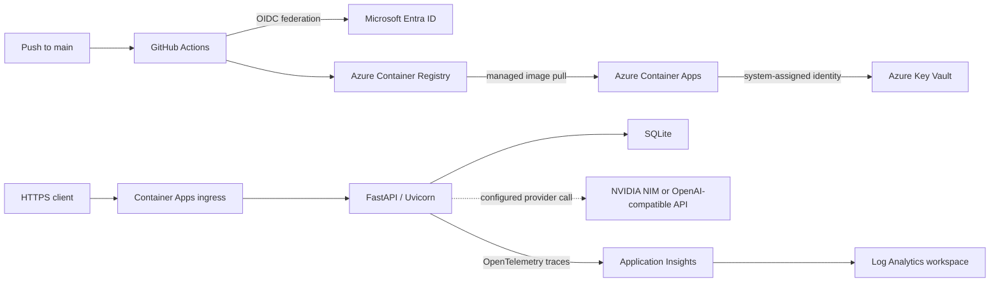

# AI Job Scout: Cloud Operations Edition


> **North Star:** “We are not improving the product. We are improving how the product is operated.”

AI Job Scout is a backend-focused job intelligence application that collects software-engineering job postings, extracts structured signals, and produces explainable recommendations. Cloud Operations Edition takes that existing application and demonstrates how to operate it on Azure with a governed foundation, repeatable container deployment, secretless workload authentication, centralized secret management, and verified request tracing.

The project deliberately leaves product behavior intact. The API, scoring rules, LLM provider boundary, database design, and user interfaces were not redesigned to create the cloud platform. The result is a completed development-environment operations case study—not a claim of production readiness or enterprise scale.

## The Problem

An application can work locally and still be difficult to operate responsibly. Before this work, AI Job Scout had no validated cloud runtime, deployment identity model, managed secret path, or application-level telemetry. The operational objective was therefore to answer five practical questions:

1. Can the existing container run reliably in a governed Azure environment?
2. Can every deployment be traced to source and verified before it is accepted?
3. Can deployment, image pull, and runtime access use separate identities without long-lived Azure credentials?
4. Can the application receive its provider credential without committing or copying the value into deployment configuration?
5. Can real requests, failures, latency, exceptions, and trace correlation be proved from the running Azure service?

All five questions were validated against the deployed runtime.

## Operational Outcome

| Capability | Validated result |
| --- | --- |
| Azure foundation | Existing subscription and resource group reused with established naming, tagging, budget, and cost-governance conventions |
| Container delivery | `linux/amd64` image stored in Azure Container Registry and deployed to Azure Container Apps |
| Continuous deployment | GitHub Actions uses OpenID Connect (OIDC), deploys traceable images, waits for a healthy revision, and verifies public HTTPS health |
| Runtime secrets | NVIDIA credential stored in Azure Key Vault and delivered through a versionless Key Vault reference using managed identity |
| Identity boundaries | GitHub deployment, ACR pull, and application runtime responsibilities remain separate and scoped |
| Application observability | Azure Monitor OpenTelemetry exports request, exception, dependency, duration, and W3C correlation telemetry to Application Insights |
| Runtime proof | The final revision was Active, Healthy, Provisioned, latest-ready, and served 100% of traffic while `/health` returned HTTP 200 |
| Regression protection | 27 automated tests passed; Docker Compose configuration and repository formatting checks also passed |

## Architecture



The normal delivery path is intentionally small:

```text
push to main
  -> test and validate
  -> authenticate to Azure with GitHub OIDC
  -> build and push a linux/amd64 image to ACR
  -> update Azure Container Apps
  -> wait for an Active and Healthy revision
  -> verify the public HTTPS /health contract
```

The deployed image owns its startup command through an exec-form Dockerfile `CMD`; Azure command and argument overrides remain absent. Container Apps revisions provide rollout state and traffic control without introducing a Kubernetes cluster or virtual-machine operations layer.

## Azure Services

| Service | Role in the project |
| --- | --- |
| Azure Resource Group | Holds the development resources under the established naming and governance boundary |
| Azure Container Registry | Stores traceable application images in repository `ai-job-scout` |
| Azure Container Apps | Runs the FastAPI container, manages revisions, public ingress, scaling, health state, and traffic |
| Microsoft Entra ID | Federates GitHub Actions and issues short-lived Azure access without a deployment client secret |
| Azure Key Vault | Stores the NVIDIA runtime credential as a versioned secret |
| Managed Identities and Azure RBAC | Authorize image pull and runtime secret access with separate responsibilities |
| Application Insights | Receives application traces through the Azure Monitor OpenTelemetry distribution |
| Log Analytics | Stores queryable request, exception, and dependency telemetry |

All deployed resources are in **East Asia**, the region permitted by the current Azure for Students subscription policy. The application runs in resource group `rg-ai-jobscout-dev` as Container App `ca-ai-jobscout-dev` inside environment `cae-ai-jobscout-dev`.

## Security Model

The project uses identity and references instead of distributing reusable credentials through the delivery pipeline.

- **Deployment:** GitHub Actions requests a short-lived OIDC token. The Entra federated credential is restricted to the repository's `main` branch, and the workflow has only `contents: read` and `id-token: write` GitHub permissions.
- **Image publication and deployment:** the GitHub deployment identity has the Azure roles required for ACR push and Container Apps deployment at their intended scopes.
- **Image pull:** the Container Apps environment identity pulls from ACR. Registry credentials are not embedded in the application.
- **Runtime secret access:** the Container App's system-assigned identity has `Key Vault Secrets User` on the dedicated vault. It resolves a versionless Key Vault reference exposed to the application through its existing `NVIDIA_API_KEY` environment contract.
- **Secret handling:** no provider credential, Azure client secret, or Application Insights connection-string value is stored in the repository or printed in the evidence documents.
- **Responsibility separation:** the deployment identity and image-pull identity do not have Key Vault data-plane access; the runtime identity does not publish images or deploy revisions.

The secret-delivery path, RBAC assignments, revision configuration, and public health behavior were validated. A meaningful live provider-secret rotation was not performed because no distinct replacement credential was available; the tested procedure and rollback steps are documented in the [secret rotation runbook](docs/phase2-secret-rotation-runbook.md).

## Observability

Application telemetry is initialized once, before FastAPI is imported, and only when `APPLICATIONINSIGHTS_CONNECTION_STRING` is present. The implementation uses the Microsoft Azure Monitor OpenTelemetry distribution and keeps the project scope trace-focused: OpenTelemetry log export, metric export, and Live Metrics are disabled.

The deployed runtime produced queryable evidence for:

- request timestamp, route name, URL, HTTP status, success state, and duration;
- W3C operation, request, and parent identifiers;
- a controlled HTTP 500 and its captured `RuntimeError` exception;
- direct request-to-exception correlation through matching operation and parent/request identifiers;
- automatically emitted dependency spans available from normal execution.

Dependency telemetry is intentionally reported as **observed but limited**. Normal health and root requests generated in-process ASGI send spans, but no external dependency call was manufactured and no business logic was changed just to produce richer data.

The temporary exception-validation route and environment flag were removed after evidence collection. The final deployed path returns 404, the clean revision remains healthy, and no test-only failure mechanism remains in the application.

## Runtime Verification

Final Azure validation was completed on **2026-07-19 (KST)**.

| Verification | Observed result |
| --- | --- |
| Final revision | `ca-ai-jobscout-dev--0000011` |
| Revision state | Active, Healthy, Provisioned, latest-ready |
| Traffic | 100% to the final revision |
| Replica state | One running replica during final verification |
| Public health | HTTPS `GET /health` returned HTTP 200 |
| Health contract | `{"status":"ok","service":"ai-job-scout-api"}` |
| Request telemetry | Real 200, 404, and controlled 500 requests recorded with timestamps, URLs, codes, success, and duration |
| Exception telemetry | Controlled `RuntimeError` recorded and correlated to its 500 request |
| Correlation | Operation IDs matched; exception parent ID matched the request ID |
| Dependency telemetry | In-process ASGI dependency spans observed; external dependency coverage remains limited |
| Tests | 27 passed; 21 non-blocking dependency deprecation warnings |
| Local runtime checks | Docker Compose configuration validated; repository diff checks passed |

The first request after scale-to-zero took approximately 24 seconds in the observed manual sample. Warm client requests were approximately 0.15–0.19 seconds, while recorded server-side request durations were measured in milliseconds. These are operational observations, not a performance benchmark.

Public health contract:

```bash
curl --fail --show-error --silent \
  https://ca-ai-jobscout-dev.kindbay-14c42b35.eastasia.azurecontainerapps.io/health
```

```json
{
  "status": "ok",
  "service": "ai-job-scout-api"
}
```

Full command output, sanitized resource state, and KQL results are preserved in the [runtime telemetry evidence](docs/phase3-runtime-evidence.md).

## Application Capabilities

Cloud Operations Edition operates the existing application without changing its product scope:

- Greenhouse job ingestion with keyword filtering;
- SQLite persistence through SQLAlchemy;
- content hashing for duplicate and update detection;
- separate job and job-analysis records;
- LLM-backed extraction through an OpenAI-compatible provider boundary;
- deterministic rule-based fallback when LLM output is unavailable or invalid;
- re-analysis of changed postings;
- explainable recommendation scoring using skills, language, visa, and location signals;
- FastAPI endpoints for jobs, analysis, recommendations, and health;
- a Streamlit dashboard and an additional Next.js client.

The recommendation result is deterministic after analysis:

```text
match_score = skill_score + language_bonus + visa_bonus + location_bonus
```

The final score is capped at `100`. See the [scoring system](docs/scoring-system.md) for the exact rules and examples.

## Repository Structure

```text
.
├── .github/workflows/
│   ├── test.yml                 # pull-request and branch CI
│   └── deploy.yml               # OIDC-based Azure deployment
├── app/
│   ├── api/                     # FastAPI routes
│   ├── agents/                  # job analysis and fallback parsing
│   ├── domain/                  # recommendation domain objects
│   ├── llm/                     # provider selection and client boundary
│   ├── repository/              # SQLAlchemy persistence boundaries
│   ├── scoring/                 # deterministic recommendation policy
│   ├── services/                # application orchestration
│   ├── main.py                  # API entry point
│   └── telemetry.py             # environment-gated Azure Monitor setup
├── docs/                        # architecture, operations, evidence, and decisions
├── frontend/dashboard.py        # Streamlit dashboard
├── scripts/                     # ingestion, seed, provider, and bootstrap helpers
├── tests/                       # unit and workflow integration tests
├── web/                         # additional Next.js client
├── Dockerfile                   # directly executable API image
├── docker-compose.yml           # local API and dashboard runtime
└── requirements.txt             # Python dependencies
```

## Run Locally

### Python

```bash
cp .env.example .env
python3.11 -m venv .venv
source .venv/bin/activate
pip install -r requirements.txt
uvicorn app.main:app --reload
```

The API is available at `http://localhost:8000`, with OpenAPI documentation at `http://localhost:8000/docs`.

### Docker Compose

```bash
docker compose up --build
```

This starts the API and Streamlit dashboard using the repository's local development configuration.

### Tests

```bash
pytest -q
docker compose config --quiet
```

Provider credentials are optional for the automated suite because LLM failure and fallback behavior are tested without requiring a live paid call.

## Operational Lessons

- A passing local application is not runtime evidence; platform state, traffic, HTTPS behavior, and telemetry must all be checked independently.
- Subscription policy is an architecture constraint. East Asia was selected only after the student subscription rejected both Korea regions.
- An image should define its own authoritative startup process. Platform-specific command overrides made deployment behavior harder to reason about.
- Revision creation is not traffic readiness. Verification must wait for the latest revision to become Active and Healthy and to receive the intended traffic.
- GitHub OIDC removes a long-lived Azure deployment secret, but it does not remove the need for narrow Azure RBAC scopes and exact federation subjects.
- A Key Vault reference proves configuration only when identity, RBAC, revision provisioning, environment mapping, and runtime behavior are verified together.
- A failed request record is not the same as exception telemetry. The exception table and correlation identifiers must be queried directly.
- Observability claims should match the telemetry actually produced. In-process dependency spans do not prove visibility into every external integration.
- Scale-to-zero saves development cost but creates a visible cold-start tradeoff.

## Scope and Future Considerations

This repository demonstrates a validated development deployment and its operating controls. It is not represented as production-ready, highly available, or enterprise-scale. The following are reasonable future considerations, not work included in this completed project:

- replace local/ephemeral SQLite with a managed, backed-up data store;
- add authentication and authorization for public application endpoints;
- execute a meaningful live Key Vault rotation when a distinct replacement provider credential exists;
- expand external dependency tracing using normal business traffic;
- define service-level objectives and introduce alerts or dashboards only when operational requirements justify them;
- evaluate minimum replicas or other availability controls against cold-start cost;
- add infrastructure as code, disaster recovery, retention, and image lifecycle policies;
- reassess region, capacity, privacy, and telemetry sampling for a real production workload.

These items are intentionally not implemented here. They would require new product, platform, cost, or reliability decisions beyond the project's validated operating scope.

## Documentation

### Architecture and Operations

- [Application and cloud architecture](docs/architecture.md)
- [Operations guide](docs/operations.md)
- [Recommendation scoring](docs/scoring-system.md)

### Deployment, Security, and Runtime Evidence

- [Container deployment design](docs/phase1-task4-deployment.md)
- [Container runtime evidence](docs/phase1-runtime-evidence.md)
- [Implemented security architecture](docs/phase2-security-architecture.md)
- [Security runtime evidence](docs/phase2-runtime-evidence.md)
- [Secret rotation runbook](docs/phase2-secret-rotation-runbook.md)
- [Observability architecture decision](docs/phase3-observability-architecture.md)
- [Application telemetry evidence](docs/phase3-runtime-evidence.md)
- [Final observability review](docs/phase3-completion-summary.md)

The evidence documents retain their original phase-based filenames as an audit trail. This README is the consolidated final project narrative.

## License

This project is licensed under the [MIT License](LICENSE).
