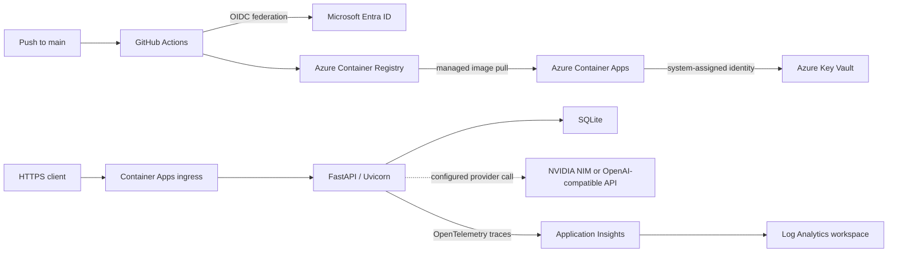

# AI Job Scout: Cloud Operations Edition


> **North Star:** “We are not improving the product. We are improving how the product is operated.”

AI Job Scout is a backend-focused job intelligence application that collects software-engineering job postings, extracts structured signals, and produces explainable recommendations.

Cloud Operations Edition takes that existing application and demonstrates how to operate it on Azure with:

- a governed Azure foundation;
- repeatable container delivery;
- secretless deployment authentication;
- managed runtime identity;
- centralized secret management;
- runtime health verification;
- and application-level distributed tracing.

The project deliberately leaves product behavior intact. The API, scoring rules, LLM provider boundary, database design, and user interfaces were not redesigned to create the cloud platform.

The result is a completed **development-environment cloud operations case study**—not a claim of production readiness, high availability, or enterprise scale.

---

## Release Status

| Workstream | Status |
| --- | --- |
| AI Job Scout v2.0.0 — Cloud Operations Edition | **Released** |
| Terraform Reproducibility Addendum | **Unreleased — Conditional Closeout** |

The official released version remains:

```text
AI Job Scout v2.0.0
Cloud Operations Edition
```

The Terraform work stored in this repository is a separate engineering addendum and is not part of the released v2.0.0 scope.

---

## The Problem

An application can work locally and still be difficult to operate responsibly.

Before Cloud Operations Edition, AI Job Scout had no validated:

- cloud runtime;
- deployment identity model;
- managed secret-delivery path;
- application-level Azure telemetry;
- revision-readiness verification;
- or public runtime evidence.

The operational objective was therefore to answer five practical questions:

1. Can the existing container run reliably in a governed Azure environment?
2. Can every deployment be traced to source and verified before it is accepted?
3. Can deployment, image pull, and runtime access use separate identities without long-lived Azure credentials?
4. Can the application receive its provider credential without committing or copying the value into deployment configuration?
5. Can real requests, failures, latency, exceptions, and trace correlation be proved from the running Azure service?

All five questions were validated against the deployed v2.0.0 runtime.

---

## Operational Outcome

| Capability | Validated result |
| --- | --- |
| Azure foundation | Existing subscription and resource group reused with established naming, tagging, budget, and cost-governance conventions |
| Container delivery | `linux/amd64` image stored in Azure Container Registry and deployed to Azure Container Apps |
| Continuous deployment | GitHub Actions uses OpenID Connect, deploys traceable images, waits for a healthy revision, and verifies public HTTPS health |
| Runtime secrets | NVIDIA credential stored in Azure Key Vault and delivered through a versionless Key Vault reference using managed identity |
| Identity boundaries | GitHub deployment, ACR pull, and application runtime responsibilities remain separate and scoped |
| Application observability | Azure Monitor OpenTelemetry exports request, exception, dependency, duration, and W3C correlation telemetry to Application Insights |
| Runtime proof | Final revision was Active, Healthy, Provisioned, latest-ready, served 100% of traffic, and returned HTTP 200 from `/health` |
| Regression protection | 27 automated tests passed; Docker Compose configuration and repository formatting checks also passed |

---

## Architecture



The normal delivery path is intentionally small:

```text
push to main
  -> test and validate
  -> authenticate to Azure with GitHub OIDC
  -> build and push a linux/amd64 image to ACR
  -> update Azure Container Apps
  -> wait for an Active and Healthy revision
  -> verify the public HTTPS /health contract
```

The deployed image owns its startup command through an exec-form Dockerfile `CMD`. Azure command and argument overrides remain absent.

Container Apps revisions provide rollout state and traffic control without introducing a Kubernetes cluster or virtual-machine operations layer.

---

## Azure Services

| Service | Role in the project |
| --- | --- |
| Azure Resource Group | Holds development resources under the established naming and governance boundary |
| Azure Container Registry | Stores traceable application images in repository `ai-job-scout` |
| Azure Container Apps | Runs the FastAPI container and manages revisions, public ingress, scaling, health state, and traffic |
| Microsoft Entra ID | Federates GitHub Actions and issues short-lived Azure access without a deployment client secret |
| Azure Key Vault | Stores the NVIDIA runtime credential as a versioned secret |
| Managed Identities and Azure RBAC | Authorize image pull and runtime secret access with separate responsibilities |
| Application Insights | Receives application traces through the Azure Monitor OpenTelemetry distribution |
| Log Analytics | Stores queryable request, exception, and dependency telemetry |

All deployed v2.0.0 resources are in **East Asia**, the region permitted by the current Azure for Students subscription policy.

The application runs in:

```text
Resource Group:
rg-ai-jobscout-dev

Container Apps Environment:
cae-ai-jobscout-dev

Container App:
ca-ai-jobscout-dev
```

---

## Security Model

The project uses short-lived identity and managed references instead of distributing reusable credentials through the delivery pipeline.

### Deployment identity

GitHub Actions requests a short-lived OIDC token.

The Microsoft Entra federated credential is restricted to the repository's `main` branch, and the workflow has only the required GitHub permissions:

```yaml
permissions:
  contents: read
  id-token: write
```

### Image publication and deployment

The GitHub deployment identity has the Azure roles required for:

- pushing images to Azure Container Registry;
- and deploying revisions to Azure Container Apps.

Roles are assigned at their intended scopes rather than through reusable Azure client secrets.

### Image pull

The Container Apps environment identity pulls images from ACR.

Registry credentials are not embedded in the application container or repository.

### Runtime secret access

The Container App's system-assigned identity has:

```text
Key Vault Secrets User
```

on the dedicated vault.

The identity resolves a versionless Key Vault reference exposed to the application through its existing:

```text
NVIDIA_API_KEY
```

environment contract.

### Secret handling

No provider credential, Azure client secret, or Application Insights connection-string value is:

- committed to the repository;
- copied into workflow configuration;
- or printed in evidence documents.

### Responsibility separation

The responsibilities remain separated:

```text
GitHub deployment identity
-> image publication and application deployment

Container Apps environment identity
-> managed image pull

Container App system-assigned identity
-> runtime Key Vault secret access
```

The deployment and image-pull identities do not have Key Vault data-plane access.

The runtime identity does not publish images or deploy revisions.

The secret-delivery path, RBAC assignments, revision configuration, and public health behavior were validated.

A meaningful live provider-secret rotation was not performed because no distinct replacement credential was available. The tested procedure and rollback steps are documented in the [secret rotation runbook](docs/phase2-secret-rotation-runbook.md).

---

## Observability

Application telemetry is initialized once, before FastAPI is imported, and only when:

```text
APPLICATIONINSIGHTS_CONNECTION_STRING
```

is present.

The implementation uses the Microsoft Azure Monitor OpenTelemetry distribution and keeps the project scope trace-focused.

The following OpenTelemetry functions remain deliberately disabled:

- log export;
- metric export;
- Live Metrics.

The deployed runtime produced queryable evidence for:

- request timestamp;
- route name;
- URL;
- HTTP status;
- success state;
- server-side duration;
- W3C operation, request, and parent identifiers;
- a controlled HTTP 500;
- its captured `RuntimeError`;
- direct request-to-exception correlation;
- and automatically emitted dependency spans from normal execution.

Dependency telemetry is intentionally reported as **observed but limited**.

Normal health and root requests generated in-process ASGI send spans, but no external dependency call was manufactured and no business logic was modified only to generate richer telemetry.

The temporary exception-validation route and environment flag were removed after evidence collection.

The final deployed path returns HTTP 404, the clean revision remains healthy, and no test-only failure mechanism remains in the application.

---

## Runtime Verification

Final Azure validation for Cloud Operations Edition was completed on **2026-07-19 KST**.

| Verification | Observed result |
| --- | --- |
| Final revision | `ca-ai-jobscout-dev--0000011` |
| Revision state | Active, Healthy, Provisioned, latest-ready |
| Traffic | 100% to the final revision |
| Replica state | One running replica during final verification |
| Public health | HTTPS `GET /health` returned HTTP 200 |
| Health contract | `{"status":"ok","service":"ai-job-scout-api"}` |
| Request telemetry | Real 200, 404, and controlled 500 requests recorded with timestamps, URLs, codes, success, and duration |
| Exception telemetry | Controlled `RuntimeError` recorded and correlated to its HTTP 500 request |
| Correlation | Operation IDs matched; exception parent ID matched the request ID |
| Dependency telemetry | In-process ASGI dependency spans observed; external dependency coverage remains limited |
| Tests | 27 passed; 21 non-blocking dependency deprecation warnings |
| Local runtime checks | Docker Compose configuration validated; repository diff checks passed |

The first request after scale-to-zero took approximately 24 seconds in the observed manual sample.

Warm client requests were approximately 0.15–0.19 seconds, while recorded server-side request durations were measured in milliseconds.

These are operational observations, not a controlled performance benchmark.

### Public health contract

```bash
curl --fail --show-error --silent \
  https://ca-ai-jobscout-dev.kindbay-14c42b35.eastasia.azurecontainerapps.io/health
```

Expected response:

```json
{
  "status": "ok",
  "service": "ai-job-scout-api"
}
```

Full command output, sanitized resource state, and KQL results are preserved in the [runtime telemetry evidence](docs/phase3-runtime-evidence.md).

---

## Application Capabilities

Cloud Operations Edition operates the existing application without changing its product scope.

The application includes:

- Greenhouse job ingestion with keyword filtering;
- SQLite persistence through SQLAlchemy;
- content hashing for duplicate and update detection;
- separate job and job-analysis records;
- LLM-backed extraction through an OpenAI-compatible provider boundary;
- deterministic rule-based fallback when LLM output is unavailable or invalid;
- re-analysis of changed postings;
- explainable recommendation scoring using skills, language, visa, and location signals;
- FastAPI endpoints for jobs, analysis, recommendations, and health;
- a Streamlit dashboard;
- and an additional Next.js client.

The recommendation result is deterministic after the analysis stage:

```text
match_score = skill_score + language_bonus + visa_bonus + location_bonus
```

The final score is capped at `100`.

See the [scoring system](docs/scoring-system.md) for the exact rules and examples.

---

## Repository Structure

```text
.
├── .github/workflows/
│   ├── test.yml                    # pull-request and branch CI
│   └── deploy.yml                  # OIDC-based Azure deployment
├── app/
│   ├── api/                        # FastAPI routes
│   ├── agents/                     # job analysis and fallback parsing
│   ├── domain/                     # recommendation domain objects
│   ├── llm/                        # provider selection and client boundary
│   ├── repository/                 # SQLAlchemy persistence boundaries
│   ├── scoring/                    # deterministic recommendation policy
│   ├── services/                   # application orchestration
│   ├── main.py                     # API entry point
│   └── telemetry.py                # environment-gated Azure Monitor setup
├── docs/                           # architecture, operations, evidence, and decisions
├── frontend/
│   └── dashboard.py                # Streamlit dashboard
├── infra/
│   └── terraform/                  # unreleased Terraform engineering addendum
├── scripts/                        # ingestion, seed, provider, and bootstrap helpers
├── tests/                          # unit and workflow integration tests
├── web/                            # additional Next.js client
├── Dockerfile                      # directly executable API image
├── docker-compose.yml              # local API and dashboard runtime
└── requirements.txt                # Python dependencies
```

---

## Run Locally

### Python

```bash
cp .env.example .env

python3.11 -m venv .venv
source .venv/bin/activate

pip install -r requirements.txt

uvicorn app.main:app --reload
```

The API is available at:

```text
http://localhost:8000
```

OpenAPI documentation is available at:

```text
http://localhost:8000/docs
```

### Docker Compose

```bash
docker compose up --build
```

This starts the API and Streamlit dashboard using the repository's local development configuration.

### Tests

```bash
pytest -q
docker compose config --quiet
```

Provider credentials are optional for the automated suite because LLM failure and fallback behavior are tested without requiring a live paid provider call.

---

## Operational Lessons

- A passing local application is not runtime evidence. Platform state, traffic, HTTPS behavior, and telemetry must be checked independently.
- Subscription policy is an architecture constraint. East Asia was selected only after the Azure for Students subscription rejected both Korea regions.
- A container image should define its own authoritative startup process. Platform-specific command overrides made deployment behavior harder to reason about.
- Revision creation is not traffic readiness. Verification must wait for the latest revision to become Active and Healthy and receive the intended traffic.
- GitHub OIDC removes a long-lived Azure deployment secret, but it does not remove the need for narrow Azure RBAC scopes and exact federation subjects.
- A Key Vault reference proves configuration only when identity, RBAC, revision provisioning, environment mapping, and runtime behavior are verified together.
- A failed request record is not the same as exception telemetry. The exception table and correlation identifiers must be queried directly.
- Observability claims should match the telemetry actually produced. In-process dependency spans do not prove visibility into every external integration.
- Scale-to-zero reduces development cost but creates a visible cold-start tradeoff.
- Valid Terraform configuration is not, by itself, evidence of reproducible infrastructure. Runtime reproducibility also requires an admissible execution environment, successful provisioning, runtime verification, destruction, and clean re-application.

---

## Terraform Reproducibility Addendum

The repository also contains an unreleased Terraform engineering addendum intended to define the Azure Cloud Operations architecture as Infrastructure as Code.

Its North Star was:

> Define it. Verify it. Destroy it. Recreate it. Stop.

The planned validation lifecycle was:

```text
Terraform implementation
-> static validation
-> isolated Azure provisioning
-> runtime verification
-> zero-drift plan
-> destroy
-> clean re-apply
-> runtime re-verification
```

### Final lifecycle status

```text
CONDITIONAL CLOSEOUT
```

The Terraform implementation and static validation were completed, but full runtime reproducibility was not demonstrated.

The required second isolated Azure Container Apps Environment could not be established under the project's frozen constraints:

- Azure for Students subscription only;
- no paid subscription;
- no alternate subscription;
- existing development environment must remain untouched;
- separate validation environment required;
- no reduction of the target architecture or success criteria.

A formal execution-feasibility checkpoint was therefore added between implementation and live provisioning:

```text
Gate 2.5
Execution Feasibility & Admission Readiness
```

Gate 2.5 concluded that no approved execution route existed for the complete validation cycle.

The correct lifecycle decision was an evidence-based Conditional Closeout rather than an indefinite blocked state or a relaxation of the original constraints.

### Supported Terraform claims

The repository supports the following claims:

- implemented Terraform configuration for an isolated Azure Container Apps architecture;
- completed Terraform formatting and static validation;
- defined Azure Container Registry, Container Apps, Key Vault, Managed Identity, RBAC, and observability resources;
- kept real secret values outside Terraform configuration and state;
- preserved the released development environment outside Terraform state;
- analyzed subscription and execution constraints using recorded evidence;
- introduced a formal execution-feasibility gate;
- completed administrative cleanup and documented Conditional Closeout.

### Unsupported Terraform claims

The repository does **not** support the following claims:

- successful provisioning of the complete target environment;
- runtime verification of the Terraform-created validation environment;
- runtime verification of Managed Identity or Key Vault access;
- runtime telemetry verification for the Terraform environment;
- zero-drift Terraform convergence;
- successful full destroy and clean re-apply of the complete target architecture;
- verified Azure infrastructure reproducibility;
- production-ready Terraform;
- or a released AI Job Scout v2.1.0.

### Cleanup result

All validation resources that had been provisioned during the attempted execution cycle were administratively removed.

Cleanup verified that:

- Terraform state became empty;
- no active validation resources remained;
- no protected development resource entered Terraform state;
- the released development environment remained Healthy;
- 100% traffic remained assigned;
- `/health` continued to return HTTP 200;
- and the validation Key Vault remained only as an expected Azure soft-deleted record.

The provider lock file was retained while temporary local Terraform runtime files and state artifacts were removed.

The Terraform addendum is retained as a technically valid but unreleased engineering artifact.

No Git tag or GitHub Release is associated with it.

---

## Scope and Future Considerations

This repository demonstrates a validated development deployment and its operating controls.

It is not represented as:

- production-ready;
- highly available;
- enterprise-scale;
- disaster-recovery ready;
- or a fully reproducible Terraform-managed cloud platform.

Reasonable future considerations include:

- replacing local or ephemeral SQLite with a managed, backed-up data store;
- adding authentication and authorization for public application endpoints;
- executing a meaningful live Key Vault rotation when a distinct replacement provider credential exists;
- expanding external dependency tracing through normal business traffic;
- defining service-level objectives and adding alerts or dashboards when operational requirements justify them;
- evaluating minimum replicas or other availability controls against cold-start cost;
- adding data retention and container-image lifecycle policies;
- reassessing region, capacity, privacy, and telemetry sampling for a real production workload;
- and revisiting Terraform runtime reproducibility only when an admissible isolated execution environment exists.

These items are not included in the released v2.0.0 scope.

They would require new product, platform, subscription, cost, or reliability decisions.

---

## Documentation

### Architecture and Operations

- [Application and cloud architecture](docs/architecture.md)
- [Operations guide](docs/operations.md)
- [Recommendation scoring](docs/scoring-system.md)

### Deployment, Security, and Runtime Evidence

- [Container deployment design](docs/phase1-task4-deployment.md)
- [Container runtime evidence](docs/phase1-runtime-evidence.md)
- [Implemented security architecture](docs/phase2-security-architecture.md)
- [Security runtime evidence](docs/phase2-runtime-evidence.md)
- [Secret rotation runbook](docs/phase2-secret-rotation-runbook.md)
- [Observability architecture decision](docs/phase3-observability-architecture.md)
- [Application telemetry evidence](docs/phase3-runtime-evidence.md)
- [Final observability review](docs/phase3-completion-summary.md)

### Terraform Engineering Addendum

Terraform implementation, validation records, lifecycle decisions, cleanup evidence, and Conditional Closeout documentation are retained under:

```text
infra/terraform/
docs/
```

The evidence documents retain their original phase- and gate-based filenames as an audit trail.

This README is the consolidated final project narrative.

---

## Portfolio Positioning

### Released Cloud Operations claim

> Operated an existing FastAPI service on Azure Container Apps using GitHub OIDC, managed identities, Key Vault secret references, revision health verification, and Azure Monitor OpenTelemetry.

### Terraform supporting claim

> Implemented and statically validated Terraform for an isolated Azure Container Apps architecture, introduced an execution-feasibility gate, preserved the released environment outside Terraform state, and completed an evidence-based Conditional Closeout when subscription constraints prevented full runtime reproducibility testing.

### Claims deliberately not made

- production-ready cloud platform;
- enterprise Azure architecture;
- production incident ownership;
- fully reproducible Terraform infrastructure;
- multi-environment Infrastructure as Code;
- Kubernetes platform operation;
- high availability;
- or disaster recovery readiness.

---

## License

This project is licensed under the [MIT License](LICENSE).
