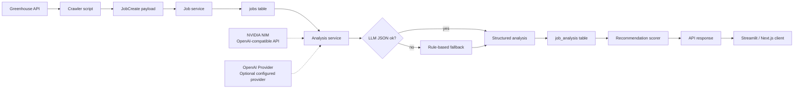

<h1 align="center">AI Job Scout</h1>

<p align="center">
Backend-focused job intelligence system that turns raw software engineering job postings into structured analysis and explainable recommendations.
</p>

<p align="center">
  
  
  
  
  
  
  
</p>

AI Job Scout is a modular FastAPI backend for collecting job postings, extracting structured job signals, and ranking analyzed jobs with deterministic scoring. The current project emphasizes explicit service boundaries, local reproducibility, LLM failure fallback, re-analysis support, and testable backend workflow.

It is not presented as a fully operated production platform. The repository does not currently include authentication, cloud deployment automation, SLOs, backup/restore automation, distributed workers, or external observability infrastructure.

The LLM integration is kept behind a lightweight provider boundary. The default development setup can use NVIDIA NIM through an OpenAI-compatible API, while OpenAI remains an optional configured provider. The app does not silently route to paid fallback providers when NVIDIA is unavailable.

## What Is Implemented

- Greenhouse job ingestion helper with keyword filtering
- Raw job storage in SQLite through SQLAlchemy
- Job content hashing for duplicate/update detection
- Separate `jobs` and `job_analysis` tables
- LLM-backed job analysis with rule-based fallback parsing
- OpenAI-compatible provider boundary for NVIDIA NIM and optional OpenAI configuration
- Re-analysis lifecycle for changed job postings
- Recommendation scoring based on skills, language signal, visa signal, and preferred country
- FastAPI endpoints for jobs, analysis, recommendations, and health checks
- Streamlit dashboard for the Docker Compose dashboard runtime
- Additional Next.js client under `web/`
- Pytest coverage for scoring, recommendation building, location parsing, health endpoints, LLM fallback, backend workflow, and job update/re-analysis lifecycle

## Stack

| Runtime Area | Technologies |
| --- | --- |
| Core runtime | Python 3.11, FastAPI, SQLAlchemy, SQLite, Docker Compose |
| LLM analysis | OpenAI Python SDK, NVIDIA NIM OpenAI-compatible API, JSON parsing, rule-based fallback |
| Default dashboard | Streamlit (`frontend/dashboard.py`) |
| Additional client | Next.js, React, TypeScript (`web/`) |
| Testing | Pytest |

## Screenshots

<p align="center">
  
</p>

<p align="center"><em>Dashboard metrics and recommendation summary.</em></p>

<p align="center">
  
</p>

<p align="center"><em>Ranked recommendation cards with match score, skill score, and bonus breakdowns.</em></p>

<p align="center">
  
</p>

<p align="center"><em>FastAPI route structure exposed through Swagger UI.</em></p>

## Architecture



The main backend flow is intentionally simple:

```text
FastAPI route
  -> service orchestration
  -> repository query/persistence
  -> provider-backed LLM analysis
  -> domain context
  -> deterministic scoring
  -> response builder
```

| Layer | Responsibility | Key Files |
| --- | --- | --- |
| API | HTTP routes and dependency injection | `app/api/`, `app/main.py` |
| Services | Job creation, analysis batches, recommendation orchestration | `app/services/job_service.py`, `app/services/recommend_service.py` |
| Repositories | SQLAlchemy query and persistence boundaries | `app/repository/` |
| Domain | Recommendation context and scoring data objects | `app/domain/` |
| Provider boundary | Environment-based LLM provider selection and OpenAI-compatible client configuration | `app/llm/` |
| Analysis | LLM extraction and fallback parsing | `app/agents/job_analyst.py` |
| Scoring | Deterministic scoring policy | `app/scoring/recommendation_scorer.py` |
| Response building | API-ready recommendation dictionaries | `app/recommendation/recommendation_builder.py` |

More detail is available in [docs/architecture.md](docs/architecture.md).

## LLM Provider Configuration

The default development setup can use NVIDIA NIM while access is available. NVIDIA access is not assumed to remain free permanently.

Configuration is environment-variable based:

```env
LLM_PROVIDER=nvidia
NVIDIA_API_KEY=your_nvidia_api_key_here
NVIDIA_BASE_URL=https://integrate.api.nvidia.com/v1
NVIDIA_MODEL=z-ai/glm-5.2
```

Optional OpenAI setup:

```env
LLM_PROVIDER=openai
OPENAI_API_KEY=your_openai_api_key_here
OPENAI_MODEL=gpt-4.1-mini
```

Supported configured providers:

- `nvidia`
- `openai`

Unsupported provider names should fail configuration clearly. The provider layer is intentionally lightweight and does not implement automatic paid fallback routing. If NVIDIA access ends, the intended next step is to swap the configured provider or evaluate a local/free model path, not to add production-style routing complexity.

Optional manual NVIDIA smoke test:

```bash
python scripts/test_nvidia_api.py
```

The smoke test is manual and should only be run when `NVIDIA_API_KEY` is configured locally. It is not part of CI.

## Recommendation Scoring

The active recommendation endpoint uses `RecommendationScorer`:

```text
match_score =
  skill_score
+ language_bonus
+ visa_bonus
+ location_bonus
```

The final score is capped at `100`.

| Component | Current Rule |
| --- | --- |
| `skill_score` | Percentage of extracted job tech stack items that appear in the user's skills |
| `language_bonus` | `10` when the analysis text includes English |
| `visa_bonus` | `10` when the user needs visa support and `visa_sponsorship == "possible"` |
| `location_bonus` | `10` when the parsed job country matches a preferred country |
| `similarity_score` | Nullable compatibility field; the active recommendation route does not calculate similarity |

Full scoring notes and examples are in [docs/scoring-system.md](docs/scoring-system.md).

## API Examples

### Health Check

```bash
curl http://localhost:8000/health
```

```json
{
  "status": "ok",
  "service": "ai-job-scout-api"
}
```

### Database Health Check

```bash
curl http://localhost:8000/health/db
```

```json
{
  "status": "ok",
  "database": "connected"
}
```

The root endpoint `/` returns a simple service message and is not the health check.

### Create a Job

```bash
curl -X POST http://localhost:8000/jobs/ \
  -H "Content-Type: application/json" \
  -d '{
    "source": "greenhouse",
    "title": "Backend Engineer",
    "company": "example-company",
    "location": "Berlin, Germany",
    "url": "https://example.com/jobs/backend-engineer",
    "description_raw": "We are looking for a backend engineer with Python, FastAPI, Docker, and SQL experience.",
    "posted_at": null
  }'
```

### Run Analysis

```bash
curl -X POST "http://localhost:8000/analysis/run?limit=20"
```

### Run Recommendations

```bash
curl -X POST http://localhost:8000/recommendations/run \
  -H "Content-Type: application/json" \
  -d '{
    "skills": ["Python", "FastAPI", "Docker", "AWS"],
    "preferred_countries": ["Germany", "Netherlands"],
    "visa_needed": true
  }'
```

Example response item:

```json
{
  "job_id": 1,
  "title": "Backend Engineer",
  "company": "example-company",
  "role": "Backend Engineer",
  "tech_stack": "Python, FastAPI, Docker",
  "skill_score": 100,
  "similarity_score": null,
  "language_bonus": 10,
  "visa_bonus": 10,
  "location_bonus": 10,
  "match_score": 100,
  "visa_sponsorship": "possible",
  "reason": "Matched skills: python, fastapi, docker; language_bonus=10; visa_bonus=10; location_bonus=10"
}
```

## Project Structure

```text
app/
|-- agents/          # LLM analysis and fallback parser
|-- api/             # FastAPI routers
|-- crawler/         # Greenhouse integration helper
|-- db/              # SQLAlchemy models, session setup, Pydantic schemas
|-- domain/          # Recommendation and lifecycle domain objects
|-- embedding/       # Similarity helper module, not used by active API route
|-- filtering/       # Recommendation filtering helper module
|-- llm/             # Lightweight provider boundary
|-- processing/      # Job processing and location parsing utilities
|-- recommendation/  # Recommendation response construction
|-- repository/      # Data access boundaries
|-- scoring/         # Recommendation scoring policies
|-- services/        # Application workflows
`-- main.py          # FastAPI entry point

frontend/
`-- dashboard.py     # Streamlit dashboard used by Docker Compose

scripts/
|-- fetch_greenhouse_jobs.py
|-- seed_jobs.py
|-- test_nvidia_api.py
`-- verify_phase2.py

tests/
|-- test_backend_workflow_integration.py
|-- test_health_routes.py
|-- test_job_analysis_fallback.py
|-- test_job_lifecycle.py
|-- test_location_parser.py
|-- test_recommendation_builder.py
`-- test_recommendation_scorer.py

web/
|-- app/
`-- src/
```

## Local Setup

### Backend

```bash
python3.11 -m venv .venv
source .venv/bin/activate
pip install -r requirements.txt
uvicorn app.main:app --reload
```

API docs are available at:

```text
http://localhost:8000/docs
```

### Environment

Create a local `.env` file from the example:

```bash
cp .env.example .env
```

NVIDIA NIM development setup:

```env
LLM_PROVIDER=nvidia
NVIDIA_API_KEY=your_nvidia_api_key_here
NVIDIA_BASE_URL=https://integrate.api.nvidia.com/v1
NVIDIA_MODEL=z-ai/glm-5.2
```

Optional OpenAI setup:

```env
LLM_PROVIDER=openai
OPENAI_API_KEY=your_openai_api_key_here
OPENAI_MODEL=gpt-4.1-mini
```

`.env` and `.venv/` are ignored by Git. `.env.example` is tracked and should contain placeholders only.

If the configured LLM request fails or returns invalid JSON, `analyze_job_text()` falls back to `analyze_job_text_rule_based()`.

### Fetch Jobs

```bash
python scripts/fetch_greenhouse_jobs.py
```

### Streamlit Dashboard

```bash
streamlit run frontend/dashboard.py
```

```text
http://localhost:8501
```

### Next.js Client

```bash
cd web
npm install
npm run dev
```

```text
http://localhost:3000
```

Optional frontend environment variable:

```env
NEXT_PUBLIC_API_BASE_URL=http://localhost:8000
```

## Docker Compose

```bash
docker compose config
docker compose up --build -d
curl http://localhost:8000/health
curl http://localhost:8000/health/db
docker compose down
```

Docker Compose starts:

- FastAPI API at `http://localhost:8000`
- Streamlit dashboard at `http://localhost:8501`

The Next.js client runs separately from `web/`.

## Testing

```bash
pytest -q
```

If `pytest` is not on PATH but the project virtual environment exists:

```bash
.venv/bin/pytest -q
```

Current tests cover:

- deterministic recommendation scoring
- recommendation response building
- location parsing
- health endpoints
- job upsert lifecycle
- changed job re-analysis lifecycle
- LLM exception and invalid JSON fallback behavior without external API calls
- current missing-field policy for valid but incomplete LLM JSON
- provider configuration without live paid or NVIDIA API calls
- service-level backend workflow from job storage through analysis, recommendation, and response schema validation

Notable gaps:

- end-to-end recommendation route response validation with a populated database
- Greenhouse API failure paths
- Streamlit and Next.js UI behavior
- Docker runtime smoke test in CI

GitHub Actions is configured in `.github/workflows/test.yml` for pull requests and pushes to `main`. It installs `requirements.txt`, runs `pytest -q`, and validates `docker compose config`. It does not call a real LLM API and does not start Docker Compose services.

## Operations

Operational notes for local development are in [docs/operations.md](docs/operations.md).

Useful commands:

```bash
docker compose ps
docker compose logs -f api
docker compose logs -f dashboard
python scripts/verify_phase2.py
```

SQLite data is stored in `jobs.db` at the repository root. The app uses `Base.metadata.create_all()` for local development and does not include Alembic migrations.

## Deeper Documentation

- [Architecture](docs/architecture.md)
- [Scoring System](docs/scoring-system.md)
- [Operations](docs/operations.md)

## Future Improvements

- Add Alembic migrations
- Expand GitHub Actions with linting or type checks if those tools are introduced
- Add endpoint-level integration tests with FastAPI dependency overrides
- Move persistence from SQLite to PostgreSQL for non-local deployments
- Add pagination, filtering, and ordering to list endpoints
- Add authentication before exposing user-specific data in a shared environment
- Add production logging, metrics, backup, and deployment runbooks before operating this beyond local/demo use
