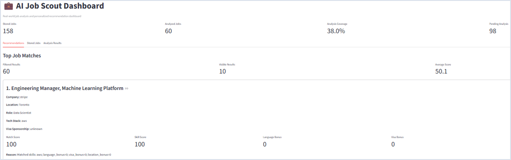
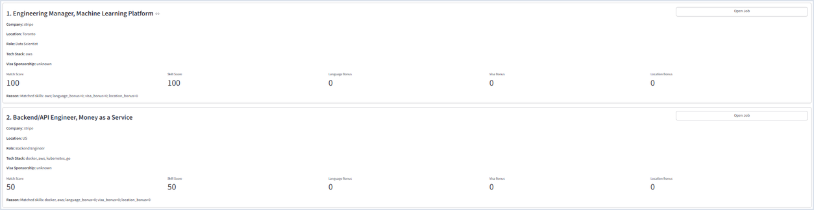
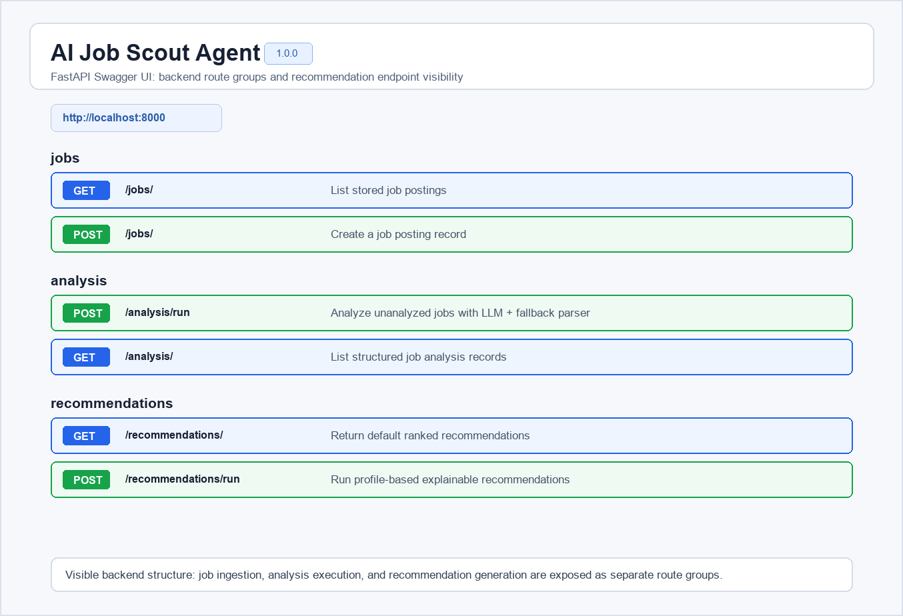
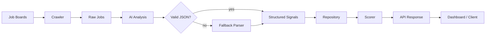

<h1 align="center">AI Job Scout</h1>

<p align="center">
Backend-focused job intelligence system that turns raw software engineering job postings into structured analysis and explainable recommendations.
</p>

<p align="center">
  
  
  
  
  
  
</p>

AI Job Scout is built as a production-minded FastAPI backend, not a single-purpose crawler. It separates ingestion, AI extraction, persistence, scoring, and response formatting so each part of the system can be tested and changed independently.

**Core stack:** Python 3.11, FastAPI, SQLAlchemy, SQLite, OpenAI API, Docker, Next.js

**Backend and system focus:**

- Modular FastAPI backend with clear API, service, repository, scoring, and builder layers
- AI-assisted job analysis with deterministic fallback parsing
- Explainable recommendation scoring with visible score components
- Repository/service/scoring architecture designed for maintainability
- Raw and processed job data stored separately for re-analysis and auditability
- Focused unit tests for scoring, parsing, and recommendation building
- Dockerized local runtime with API and dashboard entry points

## Highlights

For fast technical review:

| Area | What to Look For |
| --- | --- |
| Backend architecture | Thin FastAPI routes delegate to services, repositories, scorers, and builders |
| Reliability | LLM extraction is wrapped with a rule-based fallback parser |
| Explainability | Recommendations include skill, language, visa, and location score components |
| Maintainability | Scoring policy is isolated in `RecommendationScorer` |
| Testability | Core logic is testable without external APIs or database-heavy flows |
| Data modeling | Raw job postings and derived analysis are stored in separate tables |
| Portfolio signal | Demonstrates backend design, AI integration, ranking logic, and API delivery |

## Screenshots

<p align="center">
  
</p>

<p align="center"><em>Dashboard metrics and recommendation summary.</em></p>

<p align="center">
  
</p>

<p align="center"><em>Ranked recommendation cards with match score, skill score, and bonus breakdowns.</em></p>

<p align="center">
  
</p>

<p align="center"><em>FastAPI route structure exposed through Swagger UI.</em></p>

## System Architecture



The important boundary is intentional: AI extraction produces structured signals, while deterministic scoring ranks jobs. This keeps model variability out of the final scoring contract.

## Backend Architecture

```text
FastAPI routes
    -> service orchestration
        -> repositories
        -> domain context objects
        -> scoring policy
        -> response builder
```

| Layer | Responsibility | Key Files |
| --- | --- | --- |
| API | HTTP routes, schemas, dependency injection | `app/api/`, `app/main.py` |
| Services | Application workflow orchestration | `app/services/recommend_service.py` |
| Repositories | SQLAlchemy query isolation | `app/repository/` |
| Domain | Typed recommendation context and score objects | `app/domain/` |
| Scoring | Deterministic matching and bonus rules | `app/scoring/recommendation_scorer.py` |
| AI analysis | LLM extraction and fallback parser | `app/agents/job_analyst.py` |
| Presentation | API-ready recommendation shape | `app/recommendation/recommendation_builder.py` |

## Recommendation Pipeline

```text
Job + Analysis
    -> RecommendationContext
    -> RecommendationScorer
    -> ScoreBreakdown
    -> RecommendationBuilder
    -> ranked API response
```

Scoring is intentionally readable:

```text
match_score =
  skill_score
+ language_bonus
+ visa_bonus
+ location_bonus
```

The final score is capped at `100`.

Each recommendation explains:

- `skill_score`: match between user skills and extracted job technologies
- `language_bonus`: English-language compatibility signal
- `visa_bonus`: sponsorship signal when the user needs a visa
- `location_bonus`: country preference match
- `reason`: human-readable score explanation

## Why This Project Matters

| Principle | Backend Value |
| --- | --- |
| Explainable scoring | Rankings expose score components instead of hiding decisions behind a single number |
| Fallback parsing | LLM failures degrade analysis quality without stopping the pipeline |
| AI/scoring separation | The model extracts signals; backend code owns deterministic ranking behavior |

## Key Features

- Greenhouse job ingestion with duplicate-tolerant insertion
- Raw posting storage with SQLAlchemy models
- LLM-based structured extraction for role, tech stack, seniority, language, visa, and summary
- Rule-based fallback analysis for operational resilience
- User-profile recommendation input: skills, preferred countries, visa requirement
- Sorted recommendation output with score breakdown and explanation
- FastAPI Swagger documentation
- Next.js dashboard for running recommendations and reviewing results
- Docker Compose support for local API and dashboard runtime


## Optional: NVIDIA NIM Provider

This project can use NVIDIA-hosted NIM models through an OpenAI-compatible API.

1. Create a `.env` file from `.env.example`.
2. Set the provider and API key:

```env
LLM_PROVIDER=nvidia
NVIDIA_API_KEY=nvapi-your-key-here
NVIDIA_MODEL=z-ai/glm-5.2
```

3. Run a quick API smoke test:

```bash
python scripts/test_nvidia_api.py
```

4. Run job analysis as usual:

```bash
curl -X POST "http://localhost:8000/analysis/run?limit=5"
```

The backend keeps the same OpenAI SDK interface and only switches `base_url`, API key, and model through environment variables. This keeps AI Job Scout independent from a single LLM provider.

## API Examples

### Health Check

```bash
curl http://localhost:8000/health
```

```json
{
  "status": "ok",
  "service": "ai-job-scout-api"
}
```

### Database Health Check

```bash
curl http://localhost:8000/health/db
```

```json
{
  "status": "ok",
  "database": "connected"
}
```

### Create a Job

```bash
curl -X POST http://localhost:8000/jobs/ \
  -H "Content-Type: application/json" \
  -d '{
    "source": "greenhouse",
    "title": "Backend Engineer",
    "company": "example-company",
    "location": "Berlin, Germany",
    "url": "https://example.com/jobs/backend-engineer",
    "description_raw": "We are looking for a backend engineer with Python, FastAPI, Docker, and SQL experience.",
    "posted_at": null
  }'
```

### Run Analysis

```bash
curl -X POST "http://localhost:8000/analysis/run?limit=20"
```

### Run Recommendations

```bash
curl -X POST http://localhost:8000/recommendations/run \
  -H "Content-Type: application/json" \
  -d '{
    "skills": ["Python", "FastAPI", "Docker", "AWS"],
    "preferred_countries": ["Germany", "Netherlands"],
    "visa_needed": true
  }'
```

Example response:

```json
[
  {
    "job_id": 1,
    "title": "Backend Engineer",
    "company": "example-company",
    "role": "Backend Engineer",
    "tech_stack": "Python, FastAPI, Docker",
    "skill_score": 100,
    "language_bonus": 10,
    "visa_bonus": 10,
    "location_bonus": 10,
    "match_score": 100,
    "visa_sponsorship": "possible",
    "reason": "Matched skills: python, fastapi, docker; language_bonus=10; visa_bonus=10; location_bonus=10"
  }
]
```

## Tech Stack

| Category | Technologies |
| --- | --- |
| Backend | Python 3.11, FastAPI, Pydantic, Uvicorn |
| Database | SQLite, SQLAlchemy |
| AI processing | OpenAI API, structured JSON extraction, rule-based fallback parsing |
| Frontend | Next.js, React, TypeScript, Tailwind CSS |
| Infrastructure | Docker, Docker Compose |
| Testing | Pytest |

## Project Structure

```text
app/
|-- agents/          # LLM analysis and skill matching helpers
|-- api/             # FastAPI routers
|-- crawler/         # External job source integrations
|-- db/              # SQLAlchemy models, session setup, Pydantic schemas
|-- domain/          # Recommendation domain dataclasses
|-- processing/      # Parsing and normalization utilities
|-- recommendation/  # Recommendation response construction
|-- repository/      # Data access abstraction
|-- scoring/         # Recommendation scoring policy
|-- services/        # Application orchestration
`-- main.py          # FastAPI entry point

scripts/
`-- fetch_greenhouse_jobs.py

tests/
|-- test_location_parser.py
|-- test_recommendation_builder.py
`-- test_recommendation_scorer.py

web/
|-- app/
`-- src/
```

## Engineering Notes

| Decision | Implementation |
| --- | --- |
| Repository/service/scoring separation | Repositories load data, services orchestrate workflow, scorers calculate ranking semantics, builders format responses |
| Fallback handling | `analyze_job_text()` attempts structured LLM extraction, then uses `analyze_job_text_rule_based()` when the model call or JSON parsing fails |
| Testable core logic | `RecommendationScorer`, `RecommendationBuilder`, and `LocationParser` are isolated from HTTP and external API calls |

This keeps scoring changes from affecting routes or SQL queries, and keeps external AI failure from stopping the recommendation pipeline.

## Docs

Recommended deeper documentation:

- `docs/architecture.md` - service boundaries, data flow, and module ownership
- `docs/scoring-system.md` - scoring rules, examples, and future weighting strategy
- `docs/api-design.md` - endpoint contracts, request/response models, and error handling

## Setup

### Prerequisites

- Python 3.11
- Node.js 20 or newer
- Docker and Docker Compose, optional
- OpenAI API key, optional for LLM-backed analysis

### Backend

```bash
python3.11 -m venv .venv
source .venv/bin/activate
pip install -r requirements.txt
uvicorn app.main:app --reload
```

API docs:

```text
http://localhost:8000/docs
```

### Environment

```env
OPENAI_API_KEY=your_openai_api_key
```

### Fetch Jobs

```bash
python scripts/fetch_greenhouse_jobs.py
```

### Analyze Jobs

```bash
curl -X POST "http://localhost:8000/analysis/run?limit=20"
```

### Run Tests

```bash
pytest -q
```

Use Python 3.11. The codebase uses modern type syntax such as `str | None`.

### Next.js Dashboard

```bash
cd web
npm install
npm run dev
```

```text
http://localhost:3000
```

Optional frontend environment variable:

```env
NEXT_PUBLIC_API_BASE_URL=http://localhost:8000
```

### Docker Compose

```bash
docker compose up --build
```

Docker Compose starts:

- FastAPI API at `http://localhost:8000`
- Streamlit dashboard at `http://localhost:8501`

The Next.js dashboard runs separately from `web/`.

## Operations

### API Health Check

```bash
curl http://localhost:8000/health
```

### DB Health Check

```bash
curl http://localhost:8000/health/db
```

### Docker Health Status

```bash
docker compose ps
```

The API container uses Docker Compose healthcheck to call `/health` from inside the container.

### Docker Logs

```bash
docker compose logs -f api
docker compose logs -f dashboard
```

The API, crawler, analysis batch, and recommendation flow use Python structured logging with timestamp, log level, logger name, and message.

### Local SQLite Schema Changes

This project uses `Base.metadata.create_all()` for local development and does not include Alembic migrations yet.

When DB model fields change, an existing local `jobs.db` may not match the current schema. In that case, remove the local database and recreate it by fetching or seeding jobs again:

```bash
rm jobs.db
python scripts/fetch_greenhouse_jobs.py
```

Use this only for local development data. Do not use this approach for a production database.

### Phase 2 Lifecycle Verification

```bash
python scripts/verify_phase2.py
```

The verification script uses an isolated temporary SQLite database and does not modify the local `jobs.db`.

## Future Improvements

- Add Alembic migrations
- Move persistence from SQLite to PostgreSQL
- Add background jobs for crawling and analysis
- Add structured logging and retry policies around external APIs
- Store analysis status and fallback metadata as first-class fields
- Add embedding-based semantic similarity alongside deterministic scoring
- Expand integration tests with a temporary test database
- Add pagination, filtering, and ordering to list endpoints
