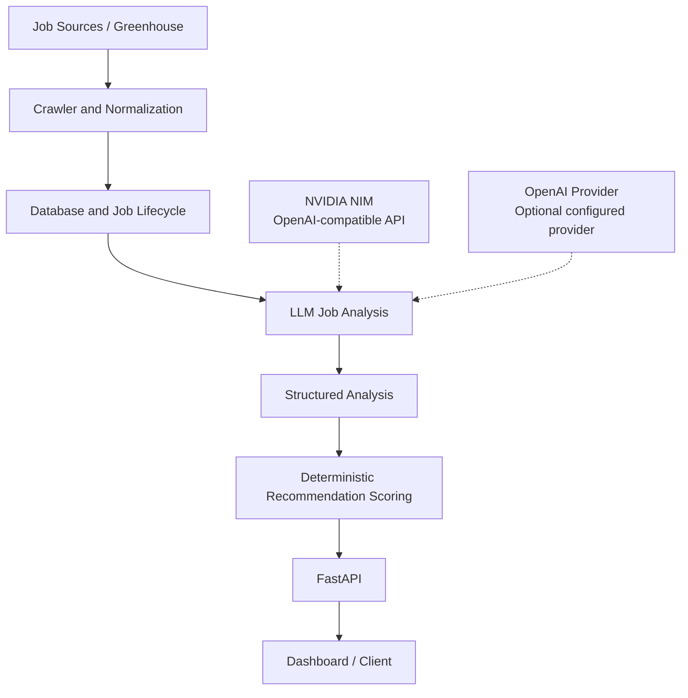

# AI Job Scout

Backend-focused job intelligence system that turns raw software engineering job postings into structured analysis and explainable recommendations.


## Project Overview

AI Job Scout is a personal portfolio project that demonstrates backend architecture, job ingestion, LLM-assisted structured extraction, and deterministic recommendation scoring. It is built around a FastAPI backend with SQLAlchemy persistence, a Greenhouse crawler, a lightweight LLM provider boundary, and a dashboard for reviewing recommendations.

The project is intentionally scoped as an honest portfolio application, not a paid multi-provider production platform.

## Why This Project Exists

Job recommendations are only useful when the user can understand why a role was recommended. This project separates the uncertain part of the system from the explainable part:

**The LLM is used for semantic extraction, while recommendation scoring remains deterministic and explainable.**

That boundary keeps model output useful without allowing model variability to control the final ranking logic.

## Design Principles

| Principle | Implementation |
| --- | --- |
| Semantic extraction only | The LLM extracts role, technologies, experience level, language requirement, visa signal, and summary from raw job text. |
| Deterministic scoring | `RecommendationScorer` calculates score components from structured analysis and user preferences. |
| Explainability over opacity | API responses include skill, language, visa, and location score components plus a readable reason. |
| Lightweight provider boundary | Provider selection is environment-variable based and limited to the configured OpenAI-compatible providers. |
| No automatic paid fallback | The app does not silently route to paid providers when NVIDIA is unavailable. That trade-off is intentional for a personal project. |

## Architecture



The NVIDIA integration sits behind the same OpenAI-compatible client interface used by the existing provider. The provider layer is deliberately small: it validates the configured provider, API key, base URL, and model, then returns a client configuration for the job analyst.

## Core Features

- Greenhouse job ingestion and normalization
- Job lifecycle handling with duplicate/update detection
- SQLAlchemy models for raw jobs and derived analysis
- LLM-assisted structured job analysis
- Rule-based fallback parsing for runtime LLM or JSON failures
- Deterministic recommendation scoring with visible score components
- FastAPI REST API and Swagger UI
- Dashboard/client for reviewing recommendations
- Docker Compose development environment
- Focused pytest suite for scoring, parsing, lifecycle, and provider configuration

## Explainable Recommendation Flow

```text
Raw job posting
    -> LLM semantic extraction
    -> Structured job analysis
    -> RecommendationContext
    -> RecommendationScorer
    -> ScoreBreakdown
    -> RecommendationBuilder
    -> Ranked API response
```

Current score formula:

```text
match_score =
  skill_score
+ language_bonus
+ visa_bonus
+ location_bonus
```

The final score is capped at `100`. The response keeps the score components separate so the recommendation can be inspected without guessing how the ranking was produced.

## LLM Provider Design

The default development setup uses NVIDIA NIM while free access is available. NVIDIA access is not assumed to remain free permanently.

Configuration remains environment-variable based:

- `LLM_PROVIDER=nvidia`
- `NVIDIA_API_KEY`
- `NVIDIA_BASE_URL`
- `NVIDIA_MODEL`

The provider layer is intentionally lightweight and does not implement automatic paid fallback routing. If NVIDIA access ends, the intended next step is to swap the configured provider or evaluate a local/free model path, not to add production-style routing complexity.

Supported configured providers:

- `nvidia`
- `openai`

Unsupported provider names raise a clear configuration error.

## Tech Stack

| Area | Tools |
| --- | --- |
| Backend | Python 3.11+, FastAPI, Pydantic, Uvicorn |
| Database | SQLite, SQLAlchemy |
| LLM integration | OpenAI Python SDK, NVIDIA NIM OpenAI-compatible API |
| Crawling | Greenhouse job source integration |
| Frontend/dashboard | Next.js, React, TypeScript, Streamlit dashboard entry point |
| Local runtime | Docker, Docker Compose |
| Testing | pytest |

## Demo / Screenshots

These screenshots are checked into the repository and reflect the current local demo UI/API.


Useful local routes for refreshing screenshots:

- Dashboard: `http://localhost:8501`
- API docs: `http://localhost:8000/docs`
- Health check: `http://localhost:8000/health`

## Installation

Python 3.11+ is required.

```bash
python3.11 -m venv .venv
source .venv/bin/activate
python -m pip install --upgrade pip
python -m pip install -r requirements.txt
```

The repository currently uses an unpinned `requirements.txt`. That keeps setup simple for portfolio review, but it means dependency versions can drift over time.

## Environment Variables

Create a local `.env` file from the example:

```bash
cp .env.example .env
```

NVIDIA NIM development setup:

```env
LLM_PROVIDER=nvidia
NVIDIA_API_KEY=your_nvidia_api_key_here
NVIDIA_BASE_URL=https://integrate.api.nvidia.com/v1
NVIDIA_MODEL=z-ai/glm-5.2
```

Optional OpenAI setup:

```env
LLM_PROVIDER=openai
OPENAI_API_KEY=your_openai_api_key_here
OPENAI_MODEL=gpt-4.1-mini
```

`.env` and `.venv/` are ignored by Git. `.env.example` is tracked and should contain placeholders only.

## Running the Application

Run the API locally:

```bash
uvicorn app.main:app --reload
```

Run with Docker Compose:

```bash
docker compose up --build
```

API:

```text
http://localhost:8000
```

Dashboard:

```text
http://localhost:8501
```

Optional Next.js client:

```bash
cd web
npm install
npm run dev
```

```text
http://localhost:3000
```

Optional NVIDIA smoke test:

```bash
python scripts/test_nvidia_api.py
```

The smoke test is manual and should only be run when `NVIDIA_API_KEY` is configured locally.

## API Examples

Health check:

```bash
curl http://localhost:8000/health
```

Create a job:

```bash
curl -X POST http://localhost:8000/jobs/ \
  -H "Content-Type: application/json" \
  -d '{
    "source": "greenhouse",
    "title": "Backend Engineer",
    "company": "example-company",
    "location": "Berlin, Germany",
    "url": "https://example.com/jobs/backend-engineer",
    "description_raw": "We are looking for a backend engineer with Python, FastAPI, Docker, and SQL experience.",
    "posted_at": null
  }'
```

Run analysis:

```bash
curl -X POST "http://localhost:8000/analysis/run?limit=20"
```

Run recommendations:

```bash
curl -X POST http://localhost:8000/recommendations/run \
  -H "Content-Type: application/json" \
  -d '{
    "skills": ["Python", "FastAPI", "Docker", "AWS"],
    "preferred_countries": ["Germany", "Netherlands"],
    "visa_needed": true
  }'
```

Example recommendation shape:

```json
[
  {
    "job_id": 1,
    "title": "Backend Engineer",
    "company": "example-company",
    "role": "Backend Engineer",
    "tech_stack": "Python, FastAPI, Docker",
    "skill_score": 100,
    "similarity_score": 0,
    "language_bonus": 10,
    "visa_bonus": 10,
    "location_bonus": 10,
    "match_score": 100,
    "visa_sponsorship": "possible",
    "reason": "Matched skills: python, fastapi, docker; language_bonus=10; visa_bonus=10; location_bonus=10"
  }
]
```

## Testing

Run the test suite:

```bash
python -m pytest
```

Current coverage focuses on deterministic scoring, recommendation building, job lifecycle behavior, location parsing, health routes, and LLM provider configuration. Tests mock provider setup and do not make live paid or NVIDIA API calls.

## Project Structure

```text
app/
|-- agents/          # LLM analysis and skill matching helpers
|-- api/             # FastAPI routers
|-- crawler/         # Greenhouse integration
|-- db/              # SQLAlchemy models, session setup, Pydantic schemas
|-- domain/          # Recommendation and lifecycle domain models
|-- llm/             # Lightweight provider boundary
|-- processing/      # Parsing and normalization utilities
|-- recommendation/  # Recommendation response construction
|-- repository/      # Data access isolation
|-- scoring/         # Deterministic recommendation scoring policy
|-- services/        # Application orchestration
`-- main.py          # FastAPI entry point

scripts/
|-- fetch_greenhouse_jobs.py
|-- seed_jobs.py
`-- test_nvidia_api.py

tests/
`-- focused unit and route tests

web/
`-- Next.js dashboard/client
```

## Design Decisions and Trade-offs

- The app keeps LLM analysis and recommendation scoring separate so ranking behavior remains inspectable.
- Provider selection uses environment variables instead of runtime model routing.
- NVIDIA NIM is the practical default while free access is available, but the code does not depend on NVIDIA-specific business logic outside the provider boundary.
- Rule-based fallback is used for analysis resilience, but provider misconfiguration raises clear errors.
- Dependencies are not pinned yet; this is acceptable for a small portfolio app but is a reproducibility trade-off.

## Current Limitations

- SQLite is used for local development, not multi-user production scale.
- Recommendation scoring is deterministic and explainable, but still simple.
- The dashboard is a demo/review surface, not a polished commercial frontend.
- No automatic paid provider fallback is implemented by design.
- Live NVIDIA access depends on externally available credentials and service availability.

## Future Considerations

- Evaluate a local Ollama provider if NVIDIA free access ends.
- Migrate Pydantic class `Config` usage to `ConfigDict`.
- Review dependency pinning for more reproducible environments.

## License

MIT License. See [LICENSE](LICENSE).
