# Architecture

AI Job Scout is a local-first FastAPI backend for collecting software engineering job postings, extracting structured signals from raw descriptions, and returning explainable job recommendations. The current design favors simple module boundaries over infrastructure breadth.

## System Context

```mermaid
flowchart LR
    A["Greenhouse board API"] --> B["scripts/fetch_greenhouse_jobs.py"]
    B --> C["app.crawler.greenhouse.fetch_greenhouse_jobs"]
    C --> D["app.services.job_service.upsert_job"]
    D --> E[("SQLite jobs table")]
    E --> F["POST /analysis/run"]
    F --> G["app.services.recommend_service.analyze_all_jobs"]
    G --> H["app.agents.job_analyst.analyze_job_text"]
    H --> I[("SQLite job_analysis table")]
    I --> J["POST /recommendations/run"]
    J --> K["RecommendationScorer"]
    K --> L["RecommendationBuilder"]
    L --> M["Streamlit or Next.js client"]
```



The API can also receive jobs directly through `POST /jobs/`, which calls `create_job()` instead of the crawler script.

## Main Data Flow

1. `fetch_greenhouse_jobs()` requests Greenhouse jobs with `content=true` and keeps titles matching engineering-related keywords.
2. `scripts/fetch_greenhouse_jobs.py` converts each item into a `JobCreate` payload.
3. `upsert_job()` stores a new row or updates an existing row by URL and content hash.
4. `POST /analysis/run` selects active or updated jobs that have no current analysis.
5. `analyze_job_text()` asks the OpenAI chat API for structured JSON.
6. If the model call or JSON parsing fails, `analyze_job_text_rule_based()` returns a simpler deterministic analysis.
7. `AnalysisRepository.save_analysis()` writes `JobAnalysis`, sets `last_analyzed_at`, and restores updated jobs to `ACTIVE`.
8. `POST /recommendations/run` loads analyzed jobs, builds `RecommendationContext`, scores each job, and returns sorted recommendation dictionaries.

## API, Service, Repository, Domain Flow

```text
app/api/routes_recommendations.py
  -> app/services/recommend_service.py
  -> app/repository/recommendation_repository.py
  -> app/domain/recommendation_models.py
  -> app/scoring/recommendation_scorer.py
  -> app/recommendation/recommendation_builder.py
```

Routes stay thin and mainly handle request models and dependency injection. Services own workflow decisions. Repositories isolate SQLAlchemy queries and persistence. Domain dataclasses carry scoring inputs and outputs. The scorer owns ranking policy. The builder converts internal scoring results into API response dictionaries.

## Raw Job vs Job Analysis

`Job` stores source data and lifecycle metadata:

- source, title, company, location, URL
- raw description text
- content hash
- status, first/last seen timestamps, last analyzed timestamp

`JobAnalysis` stores derived fields:

- role
- tech stack
- experience level
- language requirement
- visa sponsorship
- summary

The separation makes re-analysis possible without losing the original posting. When `upsert_job()` detects changed content for the same URL, it marks the job as `UPDATED`, clears `last_analyzed_at`, and deletes the existing analysis row so the next analysis batch creates a fresh derived result.

## LLM vs Deterministic Scoring

The LLM is responsible for extraction only. `app/agents/job_analyst.py` asks for structured fields from unstructured job text.

Scoring is deterministic. `RecommendationScorer.score()` calculates:

```text
skill_score + language_bonus + visa_bonus + location_bonus
```

and caps the result at `100`. This keeps recommendation ranking independent from model wording variance after extraction.

## Job Registration, Change Detection, and Re-analysis

`create_job()` inserts a job directly and commits immediately. `upsert_job()` supports crawler-style repeated ingestion:

- New URL: insert as `ACTIVE`.
- Same URL and same content hash: update `last_seen_at`; reactivate if it was `CLOSED`.
- Same URL and changed content hash: update fields, mark `UPDATED`, set `last_analyzed_at` to `None`, delete stale `JobAnalysis`.

`AnalysisRepository.get_jobs_without_analysis()` selects `ACTIVE` or `UPDATED` jobs when analysis is missing, the job is updated, or `last_analyzed_at` is empty.

## Transaction and Commit Responsibility

The current code commits inside repository/service functions:

- `create_job()` commits job inserts.
- `upsert_job()` commits created, unchanged, and updated paths.
- `AnalysisRepository.save_analysis()` commits analysis writes and job status changes.

`analyze_all_jobs()` rolls back and re-raises if a job analysis write fails. There is no external unit-of-work abstraction yet.

## External API Failure Behavior

Greenhouse requests use `requests.get(..., timeout=15)` and `raise_for_status()`. Callers should expect network and HTTP exceptions.

OpenAI analysis failures are contained inside `analyze_job_text()`. Any exception from the client call, response parsing, or JSON decoding triggers `analyze_job_text_rule_based()`. The fallback summary includes the exception type as a fallback reason.

## Clients

The Docker Compose dashboard is Streamlit at `frontend/dashboard.py`. It calls the local FastAPI API and provides tabs for recommendations, stored jobs, and analysis results.

The Next.js app under `web/` is an additional client. It fetches jobs and runs recommendations through `web/src/lib/api.ts`. It is not started by Docker Compose.

## Current Limitations

- SQLite is configured as a local repository-root `jobs.db` file.
- `Base.metadata.create_all()` is used instead of migrations.
- There is no authentication or authorization.
- There is no background worker; analysis runs synchronously through the API request.
- Streamlit and Next.js behavior is not covered by automated tests.
- Greenhouse API failures and successful OpenAI response shape variations are not fully covered by current tests.
- Older similarity-oriented helper modules exist, but the active `/recommendations/run` route uses `RecommendationScorer`.

## Future Production Work

Before using this beyond local/demo scope, the project would need migrations, managed database configuration, authentication, broader CI checks, deployment automation, secrets management, structured operational metrics, backup/restore procedures, and a clear runbook for external API failures.
