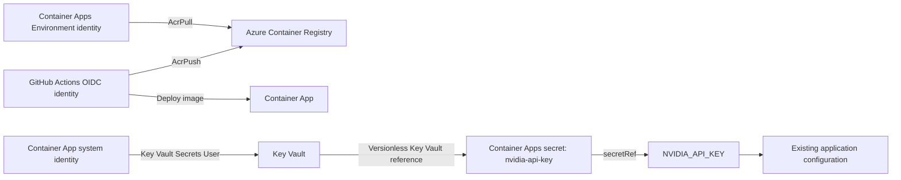

# Phase 2 Implemented Security Architecture

**Project:** AI Job Scout: Cloud Operations Edition

**Implementation state:** Complete except meaningful live credential rotation

**Gate:** CONDITIONAL PASS

**Design authority:** [Phase 2 Step 1 Security Design](phase2-step1-security-design.md)

## 1. Architecture Summary

Phase 2 implements Azure-native runtime secret delivery without changing
application code, APIs, UI, business logic, image startup behavior, ingress,
scaling, registry authentication, or the Phase 1 GitHub deployment flow.

The Azure Container App `ca-ai-jobscout-dev` uses a system-assigned managed
identity to resolve the versionless Key Vault secret `nvidia-api-key` from
`kv-ai-jobscout-dev`. Azure Container Apps exposes that application-scoped
secret to revision `ca-ai-jobscout-dev--0000007` through the existing
`NVIDIA_API_KEY` environment-variable name.

No secret value is present in source control, documentation, GitHub Actions,
image metadata, or plain Container Apps configuration.

## 2. Implemented Boundaries

### 2.1 Deployment identity

The existing Entra application and service principal `ai-job-scout-gha`
continue to authenticate GitHub Actions through the exact `main` branch OIDC
subject. The identity has no client secret or certificate credential. Its
existing responsibilities remain ACR push and Container App deployment.

It has no Key Vault data-plane role and cannot retrieve `nvidia-api-key`.

### 2.2 Image-pull identity

The existing Container Apps Environment system identity remains the ACR pull
identity through `system-environment`. It has no Key Vault role and is not used
by application code.

### 2.3 Runtime identity

The Container App has a system-assigned managed identity. That identity has
`Key Vault Secrets User` at the `kv-ai-jobscout-dev` vault scope. The vault is
dedicated to this application and environment, so vault scope remains bounded
while allowing stable versioned-secret access.

The runtime identity cannot write secrets, assign roles, push images, or deploy
revisions.

### 2.4 Human administration

Azure resource writes were completed through the Azure Portal and the Portal's
Azure Cloud Shell because local Azure CLI write tokens did not satisfy the
tenant Conditional Access MFA claim. This is an administrative-surface
limitation, not a runtime identity or architecture change.

## 3. Runtime Secret Flow

1. The running revision requests the application-scoped Container Apps secret
   named `nvidia-api-key` through `secretRef`.
2. Container Apps uses the Container App system identity to authenticate to
   `kv-ai-jobscout-dev`.
3. Azure RBAC authorizes read-only secret access through `Key Vault Secrets
   User` at vault scope.
4. The versionless Key Vault reference resolves the current enabled
   `nvidia-api-key` version.
5. Container Apps injects the resolved value into `NVIDIA_API_KEY` for the
   container process.
6. Existing `app/config.py` reads `NVIDIA_API_KEY`; no Key Vault SDK or code
   change is involved.

The secret value is intentionally not observable in Container Apps
configuration. Only the secret name, Key Vault reference, managed-identity
selection, and environment-variable-to-secret mapping are visible.

## 4. Secret Inventory

### 4.1 Runtime and application configuration

| Variable | Purpose | Classification | Implemented Azure location | Required in Azure | Migration result | Exposure risk |
| --- | --- | --- | --- | --- | --- | --- |
| `NVIDIA_API_KEY` | Authenticate to NVIDIA NIM | Runtime Secret | Key Vault `nvidia-api-key` → Container Apps Key Vault reference → `secretRef` environment mapping | Yes for current provider | Complete; no value documented | High: unauthorized use, quota/cost loss, revocation |
| `OPENAI_API_KEY` | Authenticate to OpenAI when selected | Runtime Secret | Not provisioned or exposed in this Azure environment | No; provider is not selected | Correctly not migrated | High if a live value were exposed |
| `LLM_PROVIDER` | Select the LLM provider | Non-secret Configuration | Existing application default (`nvidia`) | Yes, defaulted | Kept outside Key Vault | Medium integrity/availability risk |
| `NVIDIA_BASE_URL` | Select NVIDIA-compatible endpoint | Non-secret Configuration | Existing application default | Yes, defaulted | Kept outside Key Vault | Medium redirect/integrity risk |
| `NVIDIA_MODEL` | Select NVIDIA model | Non-secret Configuration | Existing application default | Yes, defaulted | Kept outside Key Vault | Medium cost/availability/quality risk |
| `OPENAI_MODEL` | Select OpenAI model | Non-secret Configuration | Existing application default | Only if OpenAI selected | Kept outside Key Vault | Medium cost/availability/quality risk |
| Docker command, args, port | Start the API process | Non-secret Configuration | Existing image metadata; Azure overrides remain absent | Yes | Preserved | High availability risk if changed |

### 4.2 Deployment metadata

| Value | Classification | Location | Key Vault decision | Exposure/integrity note |
| --- | --- | --- | --- | --- |
| `AZURE_CLIENT_ID` | Deployment Metadata | GitHub Actions variable/secret lookup | Outside Key Vault | Identifier, not credential |
| `AZURE_TENANT_ID` | Deployment Metadata | GitHub Actions configuration | Outside Key Vault | Integrity-sensitive tenant selector |
| `AZURE_SUBSCRIPTION_ID` | Deployment Metadata | GitHub Actions configuration | Outside Key Vault | Integrity-sensitive subscription selector |
| Resource group, ACR, image repository, app/container names | Deployment Metadata | Version-controlled deployment workflow | Outside Key Vault | Integrity-sensitive deployment targeting |
| Health URL and Git commit SHA | Deployment Metadata | Workflow/runtime metadata | Outside Key Vault | Public endpoint and provenance metadata |
| OIDC issuer, repository/ref subject, audience | Deployment Metadata | Entra federated credential/bootstrap record | Outside Key Vault | Must remain exact; broadening changes trust |

### 4.3 Local-only values

| Value | Classification | Current treatment | Azure runtime decision |
| --- | --- | --- | --- |
| Local `.env` | Local-only Development Value | Ignored by Git and Docker build context | Not uploaded or required as a file |
| `.env.example` placeholders | Local-only Development Value | Tracked, non-working examples | Not migrated |
| `NEXT_PUBLIC_API_BASE_URL` | Local-only Development Value | Optional Next.js build/runtime setting | Not part of current Azure API deployment |
| Streamlit API URL and Compose ports | Local-only Development Value | Local/Compose configuration | Not migrated |
| SQLite path/URL | Local-only Development Value | Image-derived repository path | Preserved Phase 1 behavior; not a secret |

## 5. Access-Control Matrix

| Principal | Resource | Role | Scope | Responsibility | Explicit exclusions |
| --- | --- | --- | --- | --- | --- |
| Container App system identity | `kv-ai-jobscout-dev` | `Key Vault Secrets User` | Dedicated Key Vault | Resolve current enabled secret versions at runtime | No secret write, RBAC, deployment, or ACR access |
| Container Apps Environment identity | `aijobscoutms2026` ACR | `AcrPull` | Registry | Pull deployment images | No Key Vault or deployment access |
| GitHub OIDC service principal | `aijobscoutms2026` ACR | `AcrPush` | Registry | Push SHA and convenience image tags | No Key Vault access |
| GitHub OIDC service principal | Phase 0 resource group | `Container Apps Contributor` | Existing resource-group scope | Update/inspect the Container App and revisions | No secret data-plane role or RBAC administration |
| Authorized security/platform operator | Key Vault | Portal-assigned administrative roles | Key Vault/resource scope | Store versions and maintain approved vault configuration | Must not place values in documentation or source |
| CI test identity | None | None | None | Run secret-free tests | No Azure or provider credential access |
| Local developer | Local credential only | None for routine Azure runtime | Workstation | Run local/Compose development | Does not impersonate runtime identity |

Vault-scope runtime access is slightly broader than a single-secret assignment,
but it is bounded to the dedicated application/environment vault and matches
the implemented, verified state. Adding unrelated applications' secrets to
this vault would invalidate that least-privilege assumption.

## 6. Runtime and Deployment Preservation

- Revision `ca-ai-jobscout-dev--0000007` is Active, Healthy, Provisioned, and
  has one running replica.
- The latest revision receives 100% traffic; the prior revision receives 0%.
- HTTPS `/health` returns HTTP 200 with the unchanged response contract.
- Image, resources, probes, scaling, ingress, command, args, registry settings,
  and container name remain unchanged.
- GitHub Actions, OIDC trust, SHA image deployment, revision wait, and health
  verification remain unchanged.
- No application source or dependency was changed for Key Vault integration.

## 7. Rotation Architecture

The Container Apps Key Vault reference is versionless. Microsoft documents
that Container Apps checks for a newer version within approximately 30 minutes
and restarts active revisions that consume the secret through environment
variables. See [Manage secrets in Azure Container Apps](https://learn.microsoft.com/en-us/azure/container-apps/manage-secrets).

Live rotation was not tested because no distinct valid replacement NVIDIA
credential was available. Creating an indistinguishable version with the same
value would not prove adoption and would introduce a needless restart. The
approved procedure is recorded in
[Phase 2 Secret Rotation Runbook](phase2-secret-rotation-runbook.md).

## 8. Architecture Conformance

| Principle | Implemented result |
| --- | --- |
| Product Freeze | No application behavior or product code changed |
| Minimal Intrusion | Existing environment-variable contract retained |
| Least Privilege | Deployment, image pull, and runtime secret read use separate identities |
| Secret Zero | No Azure client secret or runtime identity credential is stored |
| Separation of Concerns | Secret administration, deployment, pull, and runtime read are distinct |
| Local/Cloud Separation | Local `.env` remains local; Azure uses Key Vault |
| Azure-native first | Key Vault, managed identity, RBAC, and Container Apps references used |
| Reproducibility | Exact resource relationships and runbooks are documented; Phase 1 manual provisioning constraint remains |
