# AI Job Scout Security Threat Model

Status: current-state threat model

Last reviewed: 2026-09-26

This document describes implemented controls, trust boundaries, threats, and
residual risks. It does not claim that every identified risk is eliminated.

## 1. Scope and status

This threat model covers the current AI Job Scout production and delivery
path:

- GitHub repository governance for `main`;
- `required-ci` and the deployment provenance preflight;
- the GitHub `production` Environment and Environment-bound OIDC;
- the dedicated production deployment principal;
- Azure Container Registry (ACR) publication;
- immutable image-digest deployment;
- Azure Container Apps deployment and post-deployment verification;
- the Container App workload identity and Key Vault reference boundary;
- provider-analysis availability controls;
- public application ingress and API behavior; and
- security-relevant deployment configuration and semantic-drift checks.

Adjacent risks are included when they directly affect those boundaries. These
include replica-local SQLite state, external-provider dependency risk, GitHub
Actions and Python supply-chain risk, and public API abuse.

The following are **not implemented controls**:

- Microsoft Entra or Container Apps Easy Auth operator authentication;
- `job.write` or `analysis.execute` application-role authorization;
- durable or shared database persistence;
- multi-replica correctness or distributed work ownership;
- container image signing or cryptographic admission enforcement;
- SBOM enforcement;
- a demonstrated runtime security agent or SIEM detection layer; and
- production AI-provider execution.

Phase 4D operator authentication is paused. Tenant Conditional Access rejects
authentication from the current unregistered macOS device with
`AADSTS53003`. Device Code and Authorization Code with PKCE were both blocked,
so changing flows alone did not satisfy the device-trust requirement. The
approved resume condition is successful operator authentication from a
registered/compliant device. See
[Phase 4D Conditional Access Blocker](phase4d-conditional-access-blocker.md).

## 2. Architecture and trust boundaries

### Current production delivery path

```mermaid
flowchart LR
    Dev["Contributor or feature branch"]
    PR["Pull request"]
    CI["required-ci"]
    Main["Protected main"]
    Env["GitHub production Environment"]
    OIDC["Environment-bound OIDC"]
    Deploy["ai-job-scout-prod-deployer"]
    ACR["Dedicated ACR"]
    Digest["Immutable sha256 digest"]
    App["Azure Container App"]
    Pull["Environment pull identity"]
    Runtime["Workload managed identity"]
    Vault["Dedicated Key Vault"]
    Provider["External AI provider"]
    Caller["Public caller"]
    DB[("Replica-local SQLite")]

    Dev --> PR --> CI --> Main
    Main --> Env --> OIDC --> Deploy
    Deploy -->|"AcrPush"| ACR
    Deploy -->|"exact-app custom role"| App
    ACR --> Digest --> App
    Pull -->|"AcrPull"| ACR
    Runtime -->|"secret read"| Vault
    Caller --> App --> DB
    App -. "provider analysis disabled" .-> Provider
```

The supported path is protected `main` → `required-ci` → the `production`
Environment → Environment-bound OIDC → `ai-job-scout-prod-deployer` →
dedicated-registry `AcrPush` and the exact-target Container App role → an
immutable digest deployment.

The historical branch-bound federation, broad deployment service principal,
resource-group-wide Container Apps role, and its ACR role have been retired.
The historical bootstrap remains as evidence but exits before any Azure CLI
mutation and has no supported bypass.

### Trust-boundary table

| Boundary | Data or authority crossing it | Security question |
| --- | --- | --- |
| Contributor → pull request | Source, tests, and workflow changes | Can unreviewed code become deployable? |
| Pull request → protected `main` | Merge authority and CI result | Can governance or the required check be bypassed? |
| GitHub Actions → Entra/Azure | Short-lived OIDC assertion | Can an unintended job or ref obtain production authority? |
| Deployment principal → ACR | Image-push authority | Can an artifact be substituted or an unrelated registry be modified? |
| Deployment principal → Container App | Target-app write authority | Can resources outside the approved app be modified or secrets listed? |
| ACR artifact → revision | Immutable digest reference | Is the artifact associated with the approved commit the artifact deployed? |
| Workload identity → Key Vault | Secret-read authority | Can runtime code read secrets beyond the application boundary? |
| Public caller → FastAPI | Untrusted HTTP input | Can an anonymous caller mutate state or exhaust resources? |
| Runtime → SQLite | Job and analysis state | Can acknowledged state be lost or diverge across lifecycle events? |
| Runtime → AI provider | Job data, credential use, and spend | Can external work occur without explicit approval? |

Current runtime facts relevant to the model are:

- production deployments use `image@sha256:<digest>` references;
- `maxReplicas=1` is a temporary integrity constraint for process-local work
  ownership and replica-local persistence;
- `minReplicas=0`, so scale-to-zero and cold starts remain possible;
- `PROVIDER_ANALYSIS_ENABLED` defaults to `false`;
- when disabled, `POST /analysis/run` returns HTTP 503 with
  `provider_analysis_unavailable` before database selection, provider-client
  construction, credential use, provider calls, fallback, or persistence;
- public application ingress remains enabled; and
- application-level operator authentication and authorization are absent.

## 3. Assets

| Asset | Security relevance |
| --- | --- |
| Repository and protected `main` | Define deployable source and production workflow behavior. |
| `required-ci` | Provides the governed test result for the exact commit. |
| GitHub `production` Environment | Forms part of the production OIDC trust boundary. |
| `ai-job-scout-prod-deployer` | Can push the application image and update the target app. |
| Exact-app custom deployment role | Bounds control-plane authority to the target Container App. |
| ACR repository and image digest | Hold and identify the executable production artifact. |
| Production Container App | Hosts the public runtime and its ingress boundary. |
| Container App semantics | Include identity, ingress, secrets, registry, scaling, probes, resources, and environment variables. |
| Environment pull identity | Pulls images from the dedicated ACR. |
| Workload managed identity | Resolves the application Key Vault reference. |
| Dedicated Key Vault | Bounds runtime secret access for this application and environment. |
| Provider credential boundary | Historically enabled external authentication; the compromised NVIDIA key is revoked. |
| Provider-analysis feature state | Prevents provider execution while no provider/model is approved. |
| `jobs.db` | Contains jobs, lifecycle state, and analysis results. |
| Provenance evidence | Maps commit, workflow run, image digest, and deployed revision. |
| Semantic snapshots | Detect unintended non-image changes during deployment. |

Integrity and availability matter as much as confidentiality for several of
these assets. For example, a non-secret tenant, subscription, registry, or app
selector can still redirect or break a deployment if its integrity is lost.

## 4. Identities, credentials, and secrets

### Implemented identities

| Identity | Current purpose | Enforced boundary |
| --- | --- | --- |
| GitHub Actions preflight job | Verify the governed check for the exact commit | Read-only GitHub checks access; no OIDC token |
| GitHub Actions deploy job | Request a production OIDC token | `environment: production`; only this job gets `id-token: write` |
| `ai-job-scout-prod-deployer` | Push images and update the target app | Dedicated ACR `AcrPush` plus exact-app custom role; no Key Vault role |
| Container Apps environment identity | Pull the deployed image | Registry-scoped `AcrPull` |
| Container App system identity | Resolve the Key Vault-backed app secret | `Key Vault Secrets User` on the dedicated vault |
| Public caller | Invoke the HTTP API | No trusted application identity is established |

The deployment and image-pull identities do not have Key Vault data access.
The workload identity does not deploy revisions, push images, or administer
Azure RBAC. The deployer custom role does not include Container App
`listSecrets`, but target-app write authority remains high trust because it can
replace executable code.

### Retired identities and credentials

The historical branch-bound OIDC credential, broad deployment application and
service principal, resource-group-wide `Container Apps Contributor`, and its
historical `AcrPush` assignment were removed. Legacy repository-level
`AZURE_*` variables were also removed. Current workflows use only `PROD_*`
deployment configuration.

The historical compromised NVIDIA credential was revoked. No replacement
provider/model is approved for production. This document does not claim that
any remaining Key Vault secret object or Container App secret reference has
been removed; that is a separate cleanup decision.

### Planned operator identities

Operator-facing Entra registration artifacts used during Phase 4D testing do
not constitute an implemented control. Easy Auth is not configured,
application roles are not assigned or enforced, and repository authorization
code has not been added. They are therefore excluded from the existing-control
mapping.

Secret values must not appear in repository files, workflow summaries,
semantic snapshots, or this document. `.env` and local database files are
excluded from Git and the Docker build context. The application-facing secret
contract remains an environment variable backed by a Container Apps secret
reference and workload managed identity.

## 5. Threat register

### T1. Unauthorized production deployment

**Affected assets:** Repository, protected `main`, production workflow, and
Container App.

**Path:** An attacker or accidental change reaches deployable `main` and
causes arbitrary code to be released.

**Implemented controls:** Protected `main`, `main-governance`, the
GitHub-Actions-bound `required-ci` check, the deployment preflight for the exact
commit, the `production` Environment, and fail-closed deployment behavior.

**Residual risk:** A repository administrator can ultimately change rulesets,
workflows, or Environment policy. Test coverage and workflow correctness remain
part of the trusted computing base.

**Additional mitigation:** Add another trusted reviewer or `CODEOWNERS` rule
for security-sensitive paths when the project has an independent maintainer;
periodically review effective repository governance.

**Evidence:** `.github/workflows/test.yml`, `.github/workflows/deploy.yml`, and
the [README security model](../README.md#security-model).

### T2. OIDC token misuse or exposure

**Affected assets:** Production federation, Azure deployment authority, ACR,
and the target Container App.

**Path:** A workflow obtains Azure authority outside the intended production
context.

**Implemented controls:** No stored Azure client secret; short-lived OIDC;
Environment-bound federation; only the deploy job receives `id-token: write`;
the preflight job has no OIDC permission; the deploy job verifies the expected
repository, branch, and commit context.

**Residual risk:** Compromise of the legitimate deploy job or a privileged
GitHub account can still obtain valid production authority. GitHub and Entra
platform compromise remain external risks.

**Additional mitigation:** Periodically compare the federation subject and
GitHub Environment branch policy with the documented production boundary.

**Evidence:** `.github/workflows/deploy.yml` and
`README.md#security-model`, plus authorized Entra and GitHub Environment
metadata.

### T3. Recreation or reuse of retired broad deployment trust

**Affected assets:** Azure resource group, Container Apps, ACR, and the narrow
production trust path.

**Path:** The historical branch-bound federation or broad deployment principal
is restored and used as a fallback around the narrow production path.

**Implemented controls:** Historical federation, application/service
principal, and role assignments were removed. Active workflows have no legacy
fallback. `scripts/bootstrap_github_oidc.sh` exits with status 78 before the
historical logic or any Azure command, and a regression test enforces the
guard's position.

**Residual risk:** Future edits could remove the guard or turn the historical
guide back into active instructions.

**Additional mitigation:** Keep the retirement regression in required CI and
treat guard or superseded-guide changes as security-sensitive review.

**Evidence:** `scripts/bootstrap_github_oidc.sh`,
`tests/test_retired_azure_bootstrap.py`, and
`docs/phase1-task4-deployment.md`.

### T4. Overprivileged or compromised deployment principal

**Affected assets:** Target Container App, sibling Azure resources, runtime
secrets, and Azure authorization state.

**Path:** A deploy identity with excessive scope is compromised, or RBAC is
broadened maliciously or accidentally, allowing unrelated resource changes,
secret access, or further access grants.

**Implemented controls:** A dedicated production principal has `AcrPush` on
the dedicated registry and a custom role at the exact Container App. The role
permits the app operations needed for deployment and revision inspection, not
Key Vault reads, secret listing, or RBAC administration. There is no legacy
broad-role fallback.

**Residual risk:** Target-app write remains equivalent to executable-code
replacement. Azure RBAC does not reduce that operation to the image field
alone. A malicious image can act through the workload's runtime authority.

**Additional mitigation:** Keep deployment authority isolated from operator
and workload identities, and periodically review effective role assignments
and the custom role definition.

**Evidence:** `.github/workflows/deploy.yml` and
`README.md#security-model`, plus authorized Azure role-assignment evidence.

### T5. Artifact substitution or mutable-tag deployment

**Affected assets:** ACR artifact, deployed image, revision, and provenance
record.

**Path:** A tag is retargeted after CI or a different artifact is deployed from
the one built for the approved commit.

**Implemented controls:** The workflow pushes a correlation tag, resolves its
ACR digest, verifies that digest in the exact repository, deploys
`image@sha256:<digest>`, and verifies the app and revision image literals. The
job summary records commit-to-digest-to-revision provenance.

**Residual risk:** A digest proves content identity, not signer identity. A
compromised build job or authorized ACR publisher can produce a malicious
digest through the legitimate path. Image signing and admission enforcement
are not implemented.

**Additional mitigation:** Add signed provenance or image-signature
verification only with a defined verifier or admission point and a concrete
authorship requirement.

**Evidence:** `.github/workflows/deploy.yml` and deployment job summaries.

### T6. Forged or bypassed required check

**Affected assets:** Protected `main`, `required-ci`, and the production
workflow.

**Path:** A same-named check from an unexpected integration is accepted, or a
result for another commit is used to authorize deployment.

**Implemented controls:** The required check is named `required-ci`; repository
governance binds it to GitHub Actions. Deployment preflight queries the exact
`GITHUB_SHA`, filters for the expected GitHub Actions app provenance, ignores
same-named unexpected checks, and requires successful completion.

**Residual risk:** A compromised CI workflow or privileged repository
administrator remains able to change the source of truth.

**Additional mitigation:** Treat workflow and ruleset changes as
security-sensitive and retain periodic ruleset evidence.

**Evidence:** `.github/workflows/test.yml` and
`.github/workflows/deploy.yml`.

### T7. Production Environment or federation bypass

**Affected assets:** GitHub `production` Environment, federated credential,
and deployment principal.

**Path:** A feature branch or alternate workflow obtains the production OIDC
subject.

**Implemented controls:** The deploy job declares `environment: production`;
the Environment permits `main`; federation is Environment-bound; the workflow
has no arbitrary-ref manual deployment path; and deploy-time context checks
fail closed.

**Residual risk:** GitHub administrators can modify the Environment or workflow
policy. Periodic operational evidence is required because not all Environment
configuration is represented in repository files.

**Additional mitigation:** Periodically capture and review Environment
deployment-branch policy and the Entra federated-credential subject.

**Evidence:** `.github/workflows/deploy.yml` and authorized GitHub Environment
and Entra metadata.

### T8. Security-relevant Container App configuration drift

**Affected assets:** Container App identity, ingress, scaling, secret
references, registry settings, probes, resources, and runtime environment.

**Path:** An image deployment also changes identity, ingress, scaling, secret
references, registry configuration, probes, resources, or environment values.

**Implemented controls:** The workflow performs a narrow image-only patch,
captures sanitized protected semantics before and after deployment, and fails
when anything outside the permitted image change differs. Potentially
sensitive literals are represented with run-scoped HMAC fingerprints rather
than raw values. Tests cover accepted image changes and rejected scale or
configuration drift.

**Residual risk:** Only modeled fields are protected. Azure API evolution or a
new security-relevant setting requires the semantic contract and tests to be
updated.

**Additional mitigation:** Review protected snapshot fields whenever the
Container Apps API version or intended runtime configuration changes.

**Evidence:** `scripts/containerapp_semantic_snapshot.py`,
`tests/test_containerapp_semantic_snapshot.py`,
`tests/test_deployment_workflow.py`, and `.github/workflows/deploy.yml`.

### T9. Secret disclosure through deployment or evidence

**Affected assets:** Key Vault secrets, Container App secret references,
workflow output, and semantic evidence.

**Path:** Deployment automation reads secret values, excessive control-plane
permissions expose them, or logs and snapshots retain sensitive literals.

**Implemented controls:** The deployer has no Key Vault role and no Container
App secret-list operation. Deployment, pull, and workload identities are
separate. Semantic evidence sanitizes protected values. Git and Docker ignore
local secret files and database artifacts.

**Residual risk:** A workload compromise can use the workload identity to read
secrets in the dedicated vault. Target-app write can replace code and is
therefore high trust with respect to runtime secret use. Application-wide log
redaction has not been exhaustively demonstrated.

**Additional mitigation:** Keep unrelated secrets out of the dedicated vault,
remove obsolete provider references through a separately approved operation,
and add focused log-redaction tests where sensitive inputs are logged.

**Evidence:** `scripts/containerapp_semantic_snapshot.py`,
`tests/test_containerapp_semantic_snapshot.py`, `.gitignore`, `.dockerignore`,
and `README.md#security-model`.

### T10. Provider credential leakage or unintended provider invocation

**Affected assets:** Provider credential boundary, provider quota/budget, job
data, and analysis state.

**Path:** A public request or configuration path invokes an external provider,
spends quota, or transmits job data without an approved provider decision.

**Implemented controls:** Provider analysis defaults to disabled. The disabled
route returns HTTP 503 before database selection, provider-client construction,
credential use, calls, fallback, or mutation. The compromised NVIDIA credential
was revoked. Provider validation recorded a decision of `NONE`.

**Residual risk:** Re-enablement would reopen cost, privacy, entitlement, and
availability boundaries. Provider-side behavior remains external. A secret
object or runtime reference may remain even though the revoked credential is
not usable; this model does not claim cleanup that lacks evidence.

**Additional mitigation:** Require explicit provider/model approval and a
threat-model review before re-enablement; review outbound data and entitlement;
only provision a credential after that decision.

**Evidence:** `app/config.py`, `app/api/routes_recommend.py`,
`tests/test_provider_analysis_availability.py`, and
`docs/provider-selection-validation.md`.

### T11. Unauthorized API state mutation

**Affected assets:** Job records, local storage, dataset integrity, and future
provider-work inputs.

**Path:** An anonymous caller submits jobs with `POST /jobs/`, consuming local
storage or polluting the dataset.

**Implemented controls:** The job body is limited to 64 KiB, schema fields have
explicit maximum lengths, and provider analysis is disabled so submitted jobs
cannot currently cause provider work.

**Residual risk:** Operator authentication and role authorization are not
implemented. Public callers can create state and consume CPU or storage. This
is an open authorization gap, not a control supplied by the Phase 4D design.

**Additional mitigation:** Complete an approved operator-authentication flow
and enforce `job.write` before state mutation after the Phase 4D resume
condition is met.

**Evidence:** `app/api/routes_jobs.py`, `app/db/schemas.py`, and
`docs/phase4d-conditional-access-blocker.md`.

### T12. Public API abuse and resource exhaustion

**Affected assets:** CPU, memory, SQLite capacity, service availability, and
future provider quota.

**Path:** Repeated requests consume CPU, memory, SQLite capacity, or service
availability.

**Implemented controls:** Analysis requests have a 1–20 batch bound; enabled
provider work has a one-owner in-process lock; job creation has body and field
bounds; provider analysis is disabled; and `maxReplicas=1` prevents horizontal
provider-work amplification.

**Residual risk:** No caller-level rate limit exists. Read and recommendation
endpoints can be invoked repeatedly, and recommendation request lists do not
have equivalent explicit size bounds. The single-replica constraint also caps
availability and makes application-level denial of service easier.

**Additional mitigation:** Add caller-aware rate or request-size controls when
abuse evidence or a service objective justifies them; alert on repeated
expensive operations.

**Evidence:** `app/api/routes_jobs.py`, `app/db/schemas.py`,
`app/api/routes_recommend.py`, `app/services/recommend_service.py`, and the
provider-work boundary tests.

### T13. Compromised Action or build dependency

**Affected assets:** CI runner, repository checkout, build artifact, OIDC
deployment job, and runtime image.

**Path:** A third-party Action, Python package, or base image executes malicious
code in CI or the deployed container.

**Implemented controls:** Actions in the current CI and deployment workflows
are pinned to immutable commit SHAs. Workflow permissions are scoped by job,
only the deploy job gets OIDC, and the final artifact is deployed by digest.

**Residual risk:** Pinned Action commits can still contain or acquire upstream
security defects. `requirements.txt` uses unpinned package names, and
`Dockerfile` uses the mutable `python:3.11-slim` tag. No lockfile, dependency or
container vulnerability enforcement, SBOM gate, or signed provenance
admission control is demonstrated.

**Additional mitigation:** Establish a lock/update policy, pin the base image
by digest, scan dependencies and images, and consider SBOM or signed provenance
only with defined enforcement and ownership.

**Evidence:** `.github/workflows/test.yml`, `.github/workflows/deploy.yml`,
`requirements.txt`, and `Dockerfile`.

### T14. Runtime dependency or container exploitation

**Affected assets:** Container App runtime, workload identity, Key Vault
boundary, application state, and public service.

**Path:** A vulnerable package, interpreter, or base image is exploited after
deployment.

**Implemented controls:** Immutable deployment identifies the exact running
artifact; workload credentials are managed identities rather than embedded
Azure credentials; identity and secret scopes bound post-exploitation access.

**Residual risk:** Digest deployment does not establish that an image is free
of vulnerabilities. No enforced vulnerability scan, patch service-level
objective, or runtime exploit-detection control is evidenced.

**Additional mitigation:** Define vulnerability scanning and patch/rebuild
ownership before presenting them as controls; reduce runtime authority when
new secrets or services are added.

**Evidence:** `requirements.txt`, `Dockerfile`,
`.github/workflows/deploy.yml`, and `README.md#security-model`.

### T15. Sensitive data in logs, health responses, or evidence

**Affected assets:** Credentials, job/provider inputs, runtime configuration,
operational logs, and deployment evidence.

**Path:** Exception text, job inputs, workflow output, or configuration diffs
expose credentials or internal details.

**Implemented controls:** Deployment snapshots exclude raw protected values;
workflow evidence uses sanitized fields; provider validation retains metrics,
not response bodies; secret values are deliberately excluded from repository
evidence.

**Residual risk:** `/health/db` currently returns `str(exc)` on a database
failure. Application log redaction is not comprehensively tested, and job or
provider inputs may contain data unsuitable for verbose logging. Sanitizing the
database-health failure is future work, not an implemented Phase 4D control.

**Additional mitigation:** Return a stable non-sensitive database-health error,
document redaction expectations, and add tests for security-relevant logging
and evidence fields.

**Evidence:** `app/api/routes_health.py`,
`scripts/containerapp_semantic_snapshot.py`,
`tests/test_containerapp_semantic_snapshot.py`, and
`docs/provider-selection-validation.md`.

### T16. Loss, corruption, or divergence of application state

**Affected assets:** Jobs, lifecycle metadata, analysis rows, and the
availability and integrity of application results.

**Path:** Scale-to-zero, restart, revision replacement, or container loss
removes the local SQLite database; multiple replicas would diverge or duplicate
work.

**Implemented controls:** `maxReplicas=1` avoids concurrent replica-local
databases and cross-replica provider-work ownership. Documentation explicitly
does not claim durable or multi-replica correctness.

**Residual risk:** `jobs.db` remains on the container filesystem. Acknowledged
writes can be lost across lifecycle events, and no backup, restore, migration,
RPO, or RTO contract is implemented. This is a high-value integrity and
availability gap.

**Additional mitigation:** Introduce shared durable persistence, schema
migrations, recovery objectives and tests, and distributed work ownership
before supporting multiple replicas.

**Evidence:** `app/db/database.py`, `app/main.py`, `README.md`, and current
Container App scaling/persistence documentation.

## 6. Implemented control mapping

| Threat | Implemented control | Remaining boundary |
| --- | --- | --- |
| Unauthorized deployment | Protected `main`, governed `required-ci`, exact-SHA preflight | Administrator and workflow compromise |
| OIDC misuse | Deploy-job-only OIDC and Environment-bound federation | Compromise of the legitimate deploy context |
| Historical trust reuse | Old identity/roles removed; bootstrap fails closed | Future guard or documentation regression |
| Excess Azure authority | Dedicated ACR scope and exact-app custom role | Target-app write remains code-execution authority |
| Artifact substitution | Digest resolution, deployment, and revision verification | No signer or admission identity |
| Fake required check | Exact SHA and GitHub Actions provenance check | CI source-of-truth compromise |
| Configuration drift | Image-only patch and protected semantic comparison | Unmodeled future fields |
| Provider use | Feature disabled before downstream work | Future re-enable must reopen review |
| Secret exposure | Identity separation, no deployer vault/list-secret access | Workload compromise and app-write authority |
| Public mutation | Body and schema bounds | Authentication and authorization absent |
| State divergence | Single-replica constraint | No durability or distributed ownership |

These controls are bounded claims. For example, `maxReplicas=1` reduces
cross-replica inconsistency; it does not provide durable state or higher
availability. Likewise, immutable digests prevent tag retargeting; they do not
prove artifact safety or authorship.

## 7. Major residual risks

1. **Privileged GitHub compromise.** A repository administrator can alter
   rulesets, workflows, and Environment policy.
2. **Legitimate deployment authority compromise.** The narrow deployer is less
   privileged than the retired identity, but target-app write can replace code.
3. **Public state-changing API.** Phase 4D is paused, so operator identity and
   role enforcement do not protect `POST /jobs/`.
4. **Replica-local state.** The runtime does not meet a durable persistence
   contract and cannot safely expand beyond one replica.
5. **Software supply chain.** Python dependencies and the base-image tag are
   unpinned; scanning, SBOM enforcement, and signing are absent.
6. **Runtime workload compromise.** Application code can exercise the
   workload identity within its dedicated-vault scope.
7. **External trust dependencies.** GitHub, Azure, Entra, ACR, Key Vault, and
   any future AI provider remain external control planes or services.
8. **Logging and error disclosure.** Deployment evidence is sanitized, but
   application-wide redaction is not proven and `/health/db` exposes exception
   text on failure.
9. **No cryptographic artifact attestation.** Operational provenance is
   checked, but image signatures or attestations are not enforced.
10. **Limited detection evidence.** No demonstrated runtime security agent or
    SIEM detection-engineering layer covers suspicious deployment or runtime
    behavior.

## 8. Gaps and future work

The following classifications distinguish missing controls from decisions that
need evidence before adding complexity.

### High value, but blocked and not implemented

- Operator authentication through Entra/Easy Auth.
- `job.write` authorization for job mutation.
- `analysis.execute` authorization for provider work.
- Phase 4D may resume only after authentication succeeds from a
  registered/compliant device; Conditional Access must not be weakened to
  achieve this.

### High-value open gaps

- Replace replica-local SQLite with a durability design and explicit recovery
  objectives.
- Define safe multi-replica work ownership before increasing `maxReplicas`.
- Sanitize `/health/db` failure output.
- Remove obsolete provider secret material or references when separately
  approved and operationally verified.
- Establish dependency and base-image pinning, update, and vulnerability
  response policies.
- Add rate controls if public abuse evidence or service objectives justify
  them.

### Should consider: supply-chain controls

- dependency lock and vulnerability scanning;
- base-image digest pinning and container scanning;
- SBOM generation and enforcement; and
- signed provenance or image signing with a defined verification point.

These are not current controls. Digest deployment already prevents mutable-tag
substitution; signing would address a different authorship/attestation threat.

### Should consider: detection and operations work

- security-relevant alerting for failed deployments, OIDC, and future
  authorization events;
- audit and evidence retention policy;
- periodic effective-access review; and
- a review cadence for the GitHub ruleset, federation, custom role, and
  semantic contract.

### Defer or not justified yet

This model alone does not justify adding Kubernetes, Redis, an API gateway, a
WAF, a SIEM product, or another secrets product. Each would require a concrete
threat, service objective, or operational need.

## 9. Evidence map

| Claim | Repository or operational evidence |
| --- | --- |
| Required CI | `.github/workflows/test.yml` |
| Production deployment trust and provenance | `.github/workflows/deploy.yml` |
| Current deployment security summary | `README.md#security-model` |
| Semantic snapshot logic | `scripts/containerapp_semantic_snapshot.py` |
| Semantic regressions | `tests/test_containerapp_semantic_snapshot.py`, `tests/test_deployment_workflow.py` |
| Provider fail-closed behavior | `app/config.py`, `app/api/routes_recommend.py` |
| Provider availability regressions | `tests/test_provider_analysis_availability.py` |
| Provider decision of `NONE` | `docs/provider-selection-validation.md` |
| Retired bootstrap guard | `scripts/bootstrap_github_oidc.sh` |
| Bootstrap retirement regression | `tests/test_retired_azure_bootstrap.py` |
| Historical-guide warning | `docs/phase1-task4-deployment.md` |
| Phase 4D status and resume condition | `docs/phase4d-conditional-access-blocker.md` |
| Public job mutation and bounds | `app/api/routes_jobs.py`, `app/db/schemas.py` |
| Provider-work bounds | `app/api/routes_recommend.py`, `app/services/recommend_service.py` |
| SQLite state boundary | `app/db/database.py`, `app/main.py` |
| Database-health disclosure | `app/api/routes_health.py` |
| Local secret/database exclusions | `.gitignore`, `.dockerignore` |
| Unpinned application dependencies | `requirements.txt` |
| Mutable base-image tag | `Dockerfile` |

Operational claims that are not fully encoded in repository files—such as the
active GitHub Environment policy, Entra federation, Azure role assignments, and
historical object deletion—must continue to be supported by authorized
platform evidence. This document is not a substitute for that evidence.

## 10. Review triggers

Review and update this model when any of the following changes:

- the GitHub ruleset, required check, or check provenance;
- the `production` Environment branch policy;
- the OIDC subject, issuer, audience, or federation;
- the deployment principal, custom role, or role scope;
- ACR authorization, repository, or pull identity;
- Key Vault contents, scope assumptions, or workload identity;
- Container App ingress, identity, scaling, persistence, or secret references;
- fields protected by the semantic snapshot;
- provider analysis is re-enabled or a provider/model is approved;
- Easy Auth or application-role authorization is implemented;
- the persistence architecture changes;
- a second replica becomes supported;
- a new third-party Action enters the credential or deployment path;
- dependency, base-image, signing, or admission policy changes; or
- an incident invalidates an assumption recorded here.

The current posture is best described as a bounded, evidence-backed production
delivery trust architecture with known application, persistence, supply-chain,
and detection gaps. It must not be summarized as universally "secure."
